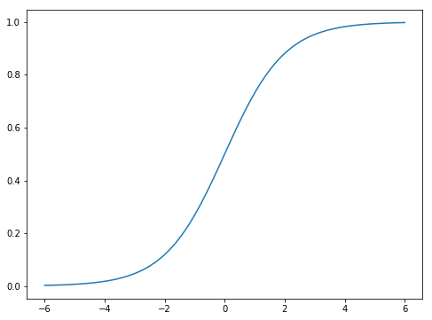
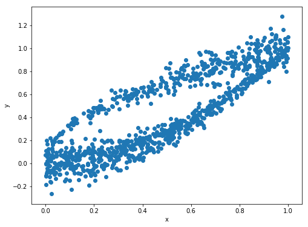
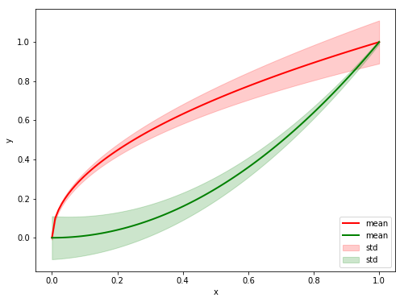

#  Machine Learning and Data Mining

~~~
\subtitle{Recapitulation}
\author{Maxim Borisyak}

\institute{National Research University Higher School of Economics (HSE)}

\usepackage{algorithm}
\usepackage{algpseudocode}
\usepackage{setspace}
\usepackage{framed}

\DeclareMathOperator*{\E}{\mathbb{E}}

\DeclareMathOperator*{\var}{\mathbb{D}}
\newcommand\D[1]{\var\left[ #1 \right]}

\newcommand\dmid{\,\|\,}

\DeclareMathOperator*{\argmin}{\mathrm{arg\,min}}
\DeclareMathOperator*{\argmax}{\mathrm{arg\,max}}
~~~

## Statistical estimations

### Setup

Given:
- data: $X = \{ x_i \}^N_{i = 1}$;
- parameterized family of distributions $P(x \mid \theta)$.

Problem:
- estimate $\theta$.

### Maximum likelihood estimation

~~~eqnarray*
L(\theta) &=& P(X \mid \theta);\\
\hat{\theta} &=& \argmax_\theta L(\theta).
~~~

~~~equation*
\mathcal{L}(\theta) = -\log \prod_i P(x_i \mid \theta) = -\sum_i \log P(x_i \mid \theta)
~~~

- consistent estimation: $\hat{\theta} \to \theta$ as $N \to \infty$;
- *might be biased*;
- equal to MAP estimation with uniform prior.

### MLE: example

> Given samples $\{ x_i \}^N_{i = 1}$ from a normal distribution estimate its mean.

~~~multline*
  \mu = \argmin_\mu \mathcal{L}(X) = \\[3mm]
    \argmin_mu -\sum_i \log \left(\frac{1}{Z} \exp\left[ -\frac{(x_i - \mu) ^ 2}{2 \sigma^2}\right]\right) = \\[3mm]
    \argmin_\mu \sum_i (x_i - \mu) ^ 2 = \frac{1}{N} \sum_i x_i
~~~

### Bayesian inference

~~~equation*
  P(\theta \mid X) = \frac{1}{Z} P(X \mid \theta) P(\theta);
~~~

- often, posterior distribution of predictions is of the main interest:
  $$P(f(x) = y \mid X) = \int \mathbb{I}\left[ f(x, \theta) = y \right] P(\theta \mid X)\;d\theta$$
- with a few exceptions posterior is intractable;
- often, approximate inference is utilized instead.

### BI: example

> Given samples $\{x_i\}^N_{i = 1}$ from a normal distribution estimate mean under a normal prior.

~~~multline*
  P(\mu \mid X) = \frac{1}{Z} P(X \mid \mu) P(\mu) = \\
    \frac{1}{Z} \exp\left[ -\frac{\mu ^ 2}{2 c^2}\right] \cdot \prod \exp\left[ -\frac{(x_i - \mu) ^ 2}{2 \sigma^2}\right]
~~~

`\vspace*{5mm}`

~~~equation*
  \log P(\mu \mid X) = -Z -\frac{\mu ^ 2}{2 c^2} -\sum_i \frac{(x_i - \mu) ^ 2}{2 \sigma^2}
~~~

### Maximum a posteriori estimation

~~~multline*
  \hat{\theta} = \argmax_\theta P(\theta \mid X) =
    \argmax_\theta P(X \mid \theta) P(\theta) =\\
    \argmin_\theta \left[  -\log P(X \mid \theta) - \log P(\theta) \right] = \\
    \argmin_\theta \left[  \mathrm{neg\;log\;likelihood} + \mathrm{penalty} \right]
~~~

~~~equation*
\hat{\theta} = \argmin_\theta \left[ -\log P(\theta) - \sum_i \log P(x_i \mid \theta)\right]
~~~

- sometimes called **structural loss**:
  - i.e. includes 'structure' of the predictor into the loss.

### MAP: example

> Given samples $\{x_i\}^N_{i = 1}$ from a normal distribution estimate mean under a normal prior.

~~~multline*
  \hat{\mu} = \argmax_\mu \log P(\mu \mid X) = \\
    \argmax_\mu \left[ -Z -\frac{\mu ^ 2}{2 c^2} - \sum_i \frac{(x_i - \mu) ^ 2}{2 \sigma^2} \right] = \\
    \argmin_\mu \left[ \lambda \mu ^ 2 + \sum_i (x_i - \mu) ^ 2 \right] =
    \frac{1}{N + \lambda} \sum_i x_i
~~~

## Machine Learning

### Structure of a Machine Learning problem

Given:
- description of the problem:
  - prior knowledge;
- data:
  - input space: $\mathcal{X}$;
  - output space: $\mathcal{Y}$;
- metric $M$.

Problem:
- find a learning algorithm: $A: \mathcal{D} \to (\mathcal{X} \to \mathcal{Y})$ such that:
  $$M(A(\mathrm{data})) \to \max$$

### Differences from statistics

Machine Learning:
- usually, probability densities are intractable;
- high-dimensionality/small sample sizes;
- hence, no p-values etc;
- less formal assumptions.

## Supervised learning

### Regression

Output: $y \in \mathbb{R}$.

`\\[5mm]`

Assumptions:
- $y = f(x) + \varepsilon(x)$;
- $\varepsilon(x)$ - noise:
  - $\forall x_1, x_2: x_1 \neq x_2 \Rightarrow \varepsilon(x_1)\;\text{independent from}\; \varepsilon(x_2)$;
  - $\forall x: \E \varepsilon(x) = 0$.

- often, $\varepsilon(x)$ is assumed not to be dependent on $x$.

### Regression loss

~~~multline*
  \mathcal{L}(f) = -\sum_i \log P((x_i, y_i) \mid f) = \\
    -\sum_i \log P_\varepsilon(y_i - f(x_i) \mid f, x_i) =\\
    -\sum_i \log P_\varepsilon(y_i - f(x_i) \mid x_i)
~~~

### Regression: MSE

- $\varepsilon \sim \mathcal{N}(0, \sigma^2_\varepsilon)$;
- $\sigma^2_\varepsilon = \mathrm{const}$ (unknown);

~~~multline*
  \mathcal{L}(f) = -\sum_i \log P_\varepsilon(y_i - f(x_i) \mid x_i) = \\
    \sum_i \left[ Z(\sigma^2_\varepsilon) - \frac{(y_i - f(x_i))^2}{2 \sigma^2_\varepsilon}\right] \sim \\
    \sum_i (y_i - f(x_i))^2 \to \min
~~~

~~~equation*
  f^*(x) = \E\left[ y \mid x \right]
~~~

### Regression: MAE

- $\varepsilon \sim \mathrm{Laplace}(0, b_\varepsilon)$;
- $b_\varepsilon = \mathrm{const}$ (unknown);

~~~multline*
  \mathcal{L}(f) = -\sum_i \log P_\varepsilon(y_i - f(x_i) \mid x_i) = \\
    \sum_i \left[ Z(b_\varepsilon) - \frac{|y_i - f(x_i)|}{2 b_\varepsilon}\right] \sim \\
    \sum_i |y_i - f(x_i)| \to \min
~~~

~~~equation*
  f^*(x) = \mathrm{median}\left[ y \mid x \right]
~~~

### Linear regression

$$f(x) = w \cdot x$$

`\footnotetext[1]{For clarity we omit the bias term as it can be included by appending 1 to every sample.}`

### Linear regression + MSE + MLE

~~~eqnarray*
  \mathcal{L}(w) &=& \sum_i (w \cdot x_i - y_i) ^ 2 = \|X w - y\|^2 \to \min;\\
  \frac{\partial}{\partial w}\mathcal{L}(w) &=& 2 X^T (X w - y) = 0;\\
  w &=& (X^T X)^{-1} X^T y.
~~~

### Linear regression + MSE + MAP

~~~eqnarray*
  \mathcal{L}(w) &=& \sum_i (w \cdot x_i - y_i) ^ 2 + \lambda \|w\|^2 =\\
    && \|X w - y\|^2 + \lambda \|w\|^2\to \min;\\
  \frac{\partial}{\partial w}\mathcal{L}(w) &=& 2 X^T (X w - y) + 2 \lambda w= 0;\\
  w &=& (X^T X + \lambda I)^{-1} X^T y.
~~~

### Linear regression + MSE + Bayesian Inference

- prior:
  $$w \sim \mathcal{N}(0, \Sigma_w);$$
- data model:
  $$\varepsilon \sim \mathcal{N}(0, \sigma^2_\varepsilon).$$

### Linear regression + MSE + Bayesian Inference

~~~multline*
P(w \mid y, X) \propto P(y \mid w, X) P(w) \propto \\[3mm]
  \exp\left[ - \frac{1}{2 \sigma^2_\varepsilon} (y - X w)^T (y - X w) \right] \cdot \exp\left[ -\frac{1}{2} w^T \Sigma^{-1}_w w \right] = \\[3mm]
  \exp\left[ - \frac{1}{2} (w - w^*)^T A_w (w - w^*) \right]
~~~

where:
- $A_w = \frac{1}{\sigma^{2}_\varepsilon}X X^T + \Sigma^{-1}_w$;
- $w^* = \frac{1}{\sigma^{2}_\varepsilon} A^{-1}_w X y$.

### Linear regression + MSE + Bayesian Inference

To make prediction $y'$ in point $x'$:

~~~multline*
P(y' \mid y, X, x') = \\
  \int P(y' \mid w, x') P(w \mid X, y) = \\
  \mathcal{N}\left( \frac{1}{\sigma^2_\varepsilon} x'^T A^{-1} X y, x'^T A^{-1} x' \right)
~~~

### Basis expansion

To capture more complex dependencies basis functions can be introduced:
$$f(x) = \sum_i w \cdot \phi(x)$$

where:
- $\phi(x) \in \mathbb{R}^K$ - expanded basis.
- $\phi$ **is fixed**.

### Basis expansion: example

Regression with polynomials:
$$\phi(x) = \{1, x_1, \dots, x_n, x^2_1, x_1 x_2, \dots, x^2_n, \dots\}$$

Periodic functions:
$$\phi(x) = \{1, \sin(x), \cos(x), \sin(2x), \cos(2x), \dots\}$$

### Basis expansion: example

`{
  \footnotesize
  Source: \texttt{eric-kim.net}
}`

### Classification

- classes: $y \in \{1, 2, \dots, m\}$;
- classifier:

~~~eqnarray*
  f: \mathcal{X} \to \mathbb{R}^m;\\
  \sum^m_{k=1} f^k(x) = 1.
~~~

~~~eqnarray*
  \mathcal{L}(f) = -\sum_i \sum^m_{k = 1} \mathbb{I}[y_i = k]\log f^k(x_i);\\
  \mathrm{cross\text{-}entopy}(f) = \sum_i y'_i \cdot f(x_i).
~~~

### Softmax

- often employed trick to make $f(x)$ a proper distribution:

~~~eqnarray*
f(x) &=& \mathrm{softmax}(g(x));\\[5mm]
f^i(x) &=& \frac{\exp(g^i(x))}{\sum_k \exp(g^k(x))}.
~~~

### Logistic regression

~~~eqnarray*
  g(x) &=& W x + b;\\
  f(x) &=& \mathrm{softmax}(g(x)).
~~~

Another form:

~~~eqnarray*
  \frac{\log P(y = i \mid x)}{\log P(y = j \mid x)} = \frac{w_i \cdot x + b_i}{w_j \cdot x + b_j}
~~~

### Logistic regression: 2 classes

~~~multline*
  f_1(x) = \frac{\exp(w_1 \cdot x + b_1)}{\exp(w_1 \cdot x + b_1) + \exp(w_2 \cdot x + b_2)} =\\[5mm]
    \frac{1}{1 + \exp((w_2 - w_1) \cdot x + b_2 - b_1)} =\\[5mm]
    \frac{1}{1 + \exp(w' \cdot x + b')} = \\[5mm]
    \mathrm{sigmoid}(w' \cdot x + b').
~~~

### Logistic regression: 2 classes

### Training logistic regression

~~~multline*
  \mathcal{L}(w) = \\
  \sum_i \mathbb{I}[y_i = 1] \log (1 + \exp(w x_i + b)) + \mathbb{I}[y_i = 0] \log (1 + \exp(-w x_i - b))
~~~

- has no analytical solution;
- smooth and convex.

### Gradient Descent

~~~eqnarray*
f(\theta) \to \min;\\
\theta^* = \argmin_\theta f(\theta).
~~~

~~~eqnarray*
  \theta^{t + 1} &=& \theta^t - \alpha \nabla f(\theta^t);\\
  \theta^t &\to& \theta^*, t \to \infty;\\
~~~

### Gradient Descent

~~~framed
\begin{spacing}{1.75}
\begin{algorithmic}[1]
  \State $\theta := \text{initialization}$
  \For{$t := 1, \dots$}
    \State $\theta := \theta - \alpha \nabla f(\theta^t)$
  \EndFor
\end{algorithmic}
\end{spacing}
~~~

### Stochastic Gradient Descent

$$f(\theta) = \sum^N_{i = 1} f_i(\theta)$$

~~~framed
\begin{spacing}{1.75}
\begin{algorithmic}[1]
  \State $\theta := \text{initialization}$
  \For{$t := 1, \dots$}
    \State $i := \mathrm{random}(1, \dots, N)$
    \State $\theta := \theta - \alpha \nabla f_i(\theta^t)$
  \EndFor
\end{algorithmic}
\end{spacing}
~~~

### Illustration

`{
  \footnotesize
  Source: \texttt{towardsdatascience.com}
}`

### Tricky example

### Tricky example

### ...

`{
  \footnotesize
  Source: \texttt{xkcd.com}
}`

## My first neural network

### Universal Approximators

~~~block {Universal Approximation Theorem}
  If $\phi$ is a non-constant, continuous, bounded, monotonic function, then every continuous function $f$ on a compact set from $\mathbb{R}^n$
  can be approximated with any precision $\varepsilon > 0$ by:
    $$g(x) = c + \sum^N_{i = 1} \alpha_i \phi(w_i \cdot x + b_i)$$
  given large enough $N$.
~~~

### Universal Approximators

### How to train a neural network

Stochastic Gradient Descent and Co.

### How to train a neural network

Stochastic Gradient Descent and Co.

- how to initialize?
- how to choose an appropriate learning rate?
- how many units?
- which activation function to choose?
