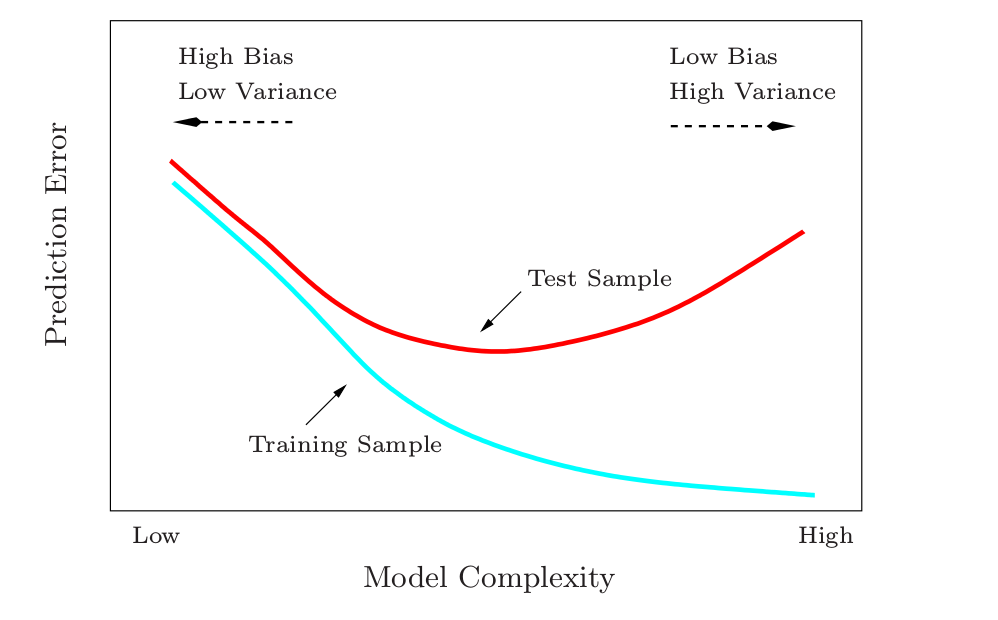
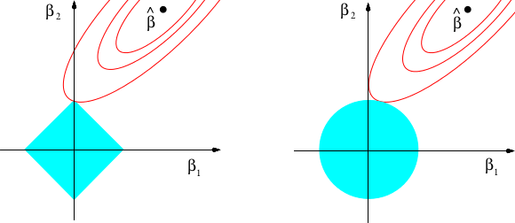
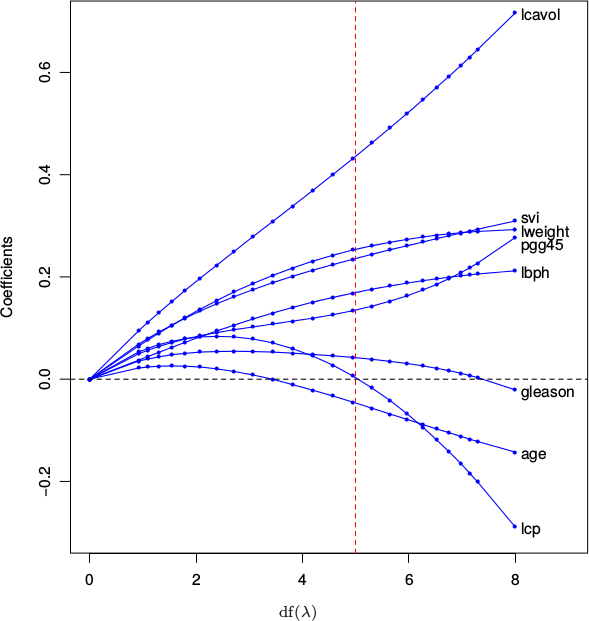
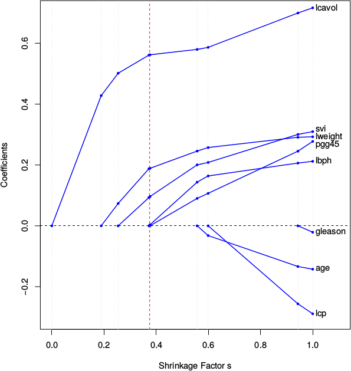
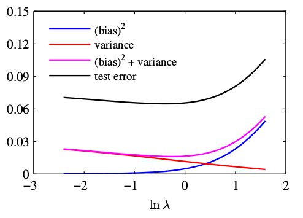

# Bias-Variance decomposition and regularisation

~~~
\subtitle{Machine Learning and Data Mining}
\author{Maxim Borisyak}

\institute{National Research University Higher School of Economics (HSE)}
\usepackage{amsmath}

\DeclareMathOperator*{\E}{\mathbb{E}}

\DeclareMathOperator*{\var}{\mathbb{D}}
\newcommand\D[1]{\var\left[ #1 \right]}
~~~

## Bias-Variance decomposition

### Bias-Variance decomposition

Settings:
- random variable $x$ and $t \sim x$;
- ground truth: $h(x) = \mathbb{E}[t \mid x]$;
- a regressor $y(x)$;
- MSE loss: $L = \sum_i (y(x_i) - t_i) ^ 2$

### Bias-Variance decomposition
Expected loss:

~~~multline*
  \mathcal{L} = \E_{x, t}[L] = \E_{x, t}[(y(x) - t) ^ 2]=\\
    \E_{x, t}(y(x) - h(x)) ^ 2 + \E_{x, t} (h(x) - t)^2 + 2\E_{x, t} (y(x) - h(x))(h(x) - t)
~~~

- $\E_{x, t} (h(x) - t)^2 = \sigma^2$ - irreducible error;
- $\E_{x, t} (y(x) - h(x))(h(x) - t) = 0$;
- $\E_{x, t}(y(x) - h(x)) ^ 2$ - of our main interest;

### Bias-Variance decomposition

Our main interest is to derive behavior of $y(x, D)$ for a different training
datasets $D$. `\\`
Let $\hat{y}(x) = \E_{D} y(x, D)$:

~~~multline*
  \E_{x, D}(y(x, D) - h(x)) ^ 2 =\\
  \E_{x, D}\left[ y(x, D) - \hat{y}(x) + \hat{y}(x) - h(x) \right]^2 =\\
  \E_{x, D}\left[ y(x, D) - \hat{y}(x) \right]^2 + \E_{x, D}\left[ \hat{y}(x) - h(x) \right]^2 + \\
  2 \E_{x, D}(y(x, D) - \hat{y}(x))(\hat{y}(x) - h(x))
~~~

### Bias-Variance decomposition

~~~multline*
\underbrace{\E_{x, D}(y(x, D) - h(x)) ^ 2}_{\text{\large expected error}} =\\[5mm]
  \underbrace{\E_{x, D}\left[ y(x, D) - \hat{y}(x) \right]^2}_{\text{\large variance}} +
  \underbrace{\E_{x, D}\left[ \hat{y}(x) - h(x) \right]^2}_{\text{\large bias}^2} + \\[5mm]
  \underbrace{2 \E_{x, D}(y(x, D) - \hat{y}(x))(\hat{y}(x) - h(x))}_{\text{\large  =0}}
~~~

### Bias-Variance

### Bias-Variance

~~~eqnarray*
\text{\large high bias} &\Leftrightarrow& \text{\large undertrained}\\[10mm]
\text{\large high variance} &\Leftrightarrow& \text{\large overtrained}
~~~

## Regularization

### Regularization: origins

Notation:
- $X$ - data (features + labels);
- $\theta$ - parameters of algorithm;

Almost every machine learning algorithm ever:

~~~eqnarray*
  P(\theta \mid X) &\to& \max;\\
  P(\theta \mid X) &=& \frac{1}{P(X)} P(X \mid \theta) P(\theta);\\
  \mathcal{L} &=& -\log P(\theta \mid X) =\\
    &&-\left[ \underbrace{- \log P(X) }_{\text{\large const}} + \underbrace{\log P(X \mid \theta)}_{\text{\large likelihood}} +
    \underbrace{ \log P(\theta)}_{\text{\large regularization}} \right]
~~~

### Regularization

Regularization is essentially constraints on parameters:

~~~eqnarray*
  \mathcal{L} = -\log P(X \mid \theta) - \log P(\theta) \to \min;
~~~

Using Lagrange multipliers:

~~~eqnarray*
-\log P(X \mid \theta) &\to& \min;\\
  \text{subject to:}&&\log P(\theta) \leq C
~~~

### Discussion

~~~center
\Large What is happening from Bayesian view when regularization term is omitted (i.e. maximum likelihood fits)?
~~~

### Regularization: example

Let introduce Gaussian prior over parameters:
$$\theta \sim \mathcal{N}(0, \sigma\mathbb{I})$$

~~~multline*
-\log P(\theta) =\\
  -\log \left[\frac{1}{\sqrt{(2\pi)^k}} \cdot \exp\left( -\frac{1}{2\sigma} \|\theta\|^2_2 \right) \right]=\\
  \mathrm{const} + \frac{1}{2\sigma} \|\theta\|^2
~~~

Gaussian prior results in familiar $l_2$ regularization.

### Example: logistic regression

Consider logistic regression:

~~~eqnarray*
\mathcal{L} = \frac{1}{n} \sum^{n}_{i = 1} \textnormal{cross-entropy}(f_\theta(x_i), y_i) + \lambda \|w\|^2
~~~

where:
- $\theta = \{w, b\}$ - parameters;
- $f_\theta(x) = \sigma(wx + b)$ - decision function.

`\vspace*{10mm}`

$$\|w\|^2 \leq \frac{1}{\lambda} \log 2$$

### Example: $l_1$ vs $l_2$

$l_1$ regularization:
$$\mathcal{L} = -\log P(X \mid \theta) + \lambda |\theta|_1$$

- tends to produce sparse vectors;
- can be used for feature selection;

$l_2$ regularization:
$$\mathcal{L} = -\log P(X \mid \theta) + \lambda |\theta|^2_2$$

- shrinks coefficients;
- never (almost surely) produces sparse vector.

### Example: $l_1$ vs $l_2$

### Example: ridge regression

`\vspace*{5mm}`

Ridge-regression is a linear regression with $l_2$ regularization:
$$\mathcal{L} = \frac{1}{n}\sum^{n}_{i = 1} (w^T x_i - y_i)^2 + \lambda \|w\|^2_2$$

Exact solution:
$$w^* = (X^T X + \lambda I)^{-1} X^T y$$

Compare to linear regression:
$$w^* = (X^T X)^{-1} X^T y$$

Eigen-values shrink:
$$d_j \to \sqrt{\frac{d^2_j}{d^2_j + \lambda}}$$

### Example: LASSO

LASSO is a linear regression with $l_1$ regularization:
$$\mathcal{L} = \frac{1}{n}\sum^{n}_{i = 1} (w^T x_i - y_i)^2 + \lambda |w|_1$$

No closed-form solution.

### Ridge vs. LASSO

~~~center
Ridge regression:
~~~

***

~~~center
LASSO:
~~~

### Exotic regularizations

`\vspace{5mm}`
Almost every restriction on parameters can be imposed via regularization.

- prior on solution $w^0$ to a similar problem:
$$\|w - w^0\|^2_2$$
- adaptive regularization:
$$\sum_i c_i w^2_i$$
  where $c_i$ is increasing with $i$;
- binding weights:
  $$\sum_{i, j \in B} \| w_i - w_j \|^2_2$$

## Regularization and bias-variance

### Regularization and bias-variance

Regularization allows to control complexity of the model.

~~~multline*
\text{stronger regularization} \Rightarrow\\
  \text{lower model complexity} \Rightarrow \\
    \text{lower variance}\;\mathrm{and}\;\text{higher bias}
~~~

### Regularization and bias-variance

### Discussion

Is quantity $$E = \mathrm{bias}^2 + \mathrm{variance}$$ preserved when regularization changes?`\\[10mm]`
Does stronger regularization always imply higher bias?`\\[10mm]`
Does stronger regularization imply lower variance?

### Examples

Stronger regularization $\Rightarrow$ bias up, variance down.`\\`

Almost all real-world cases.

### Examples

Stronger regularization $\Rightarrow$ bias **down**, variance down.`\\`

Consider:
- $y = 0 \cdot x + \varepsilon$;
- $f(x) = w \cdot x$;

~~~equation*
\mathrm{reg}(w) = \begin{cases}
  w^2, \text{if } w \geq 0,\\
  +\infty, \text{otherwise}.
\end{cases}
~~~

### Examples

Stronger regularization $\Rightarrow$ bias up, variance **up**.`\\`

Consider:
- $y = x^2$ --- deterministic;
- $x \sim U[0, 1]$;
- $f(x) = a x + b x^2$;

~~~equation*
\mathrm{P}(a, b) = \mathbb{I}[a \in [0, 1]] \cdot \phi(b).
~~~

where:
- $\phi$ - density of standard normal distribution.

~~~
\vfill
{ \footnotesize Impossible to achieve for strictly convex prior and continuous models. }
~~~

### Examples

Stronger regularization $\Rightarrow$ bias **down**, variance **up**.`\\`

Consider:
- $y = 0 \cdot x + \varepsilon$;
- $f(x) = w \cdot x$;

~~~equation*
\mathrm{P}(w) = \frac{1}{Z} \begin{cases}
  \frac{1}{2} \phi(w - w_0) + \frac{1}{2} \phi(w + w_0), & \text{if } w > w_1;\\
  0, & \text{otherwise}.
\end{cases}
~~~

where:
- $\phi$ - density of standard normal distribution;
- $w_0 > 0$, $w_1 < 0$, $w_1 < -w_0$.

~~~
\vfill
{ \footnotesize Impossible to achieve for strictly convex prior and continuous models. }
~~~

## Summary

### Summary

- expected error can be decomposed into:
$$\text{expected error} =  \mathrm{bias}^2 + \mathrm{variance} + \mathrm{irreducable\;noise}$$
- prior knowledge can be expressed via regularization;
- regularization usually controls bias-variance tradeoff.

### References

- Bishop, C.M., 2006. Pattern recognition and machine learning. springer.
- Friedman, J., Hastie, T. and Tibshirani, R., 2001. The elements of statistical learning (Vol. 1, pp. 241-249). New York: Springer series in statistics.
