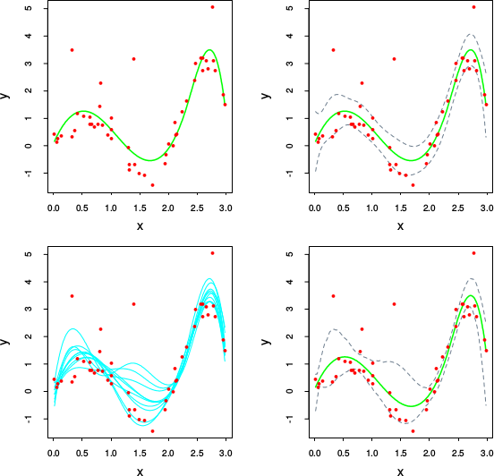
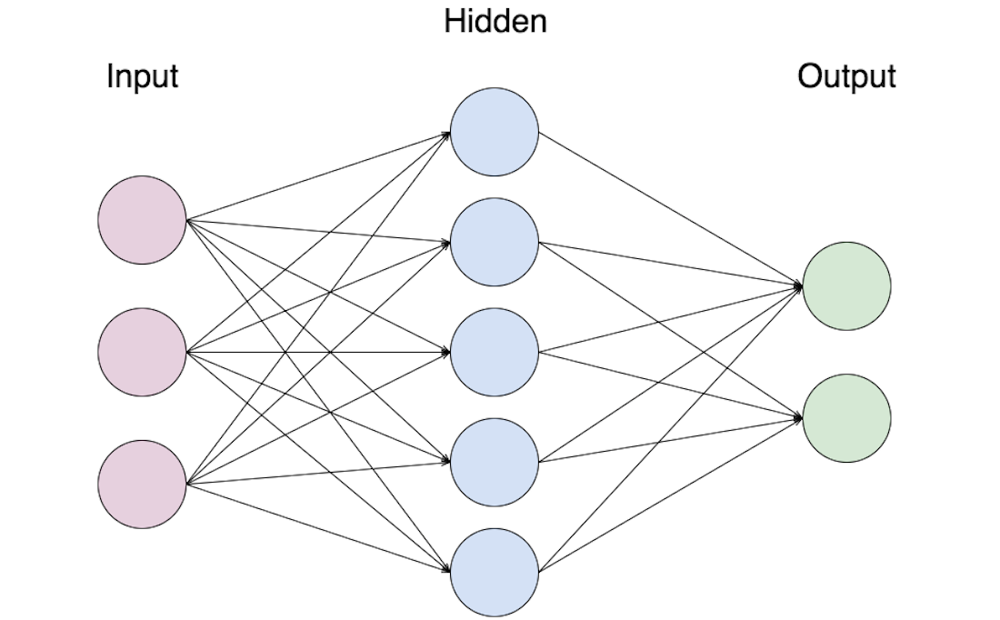
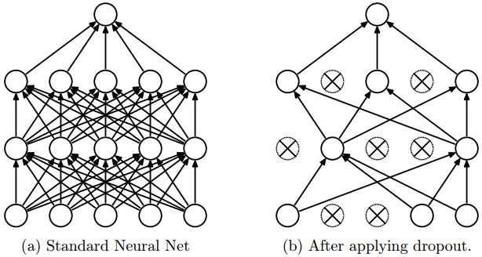
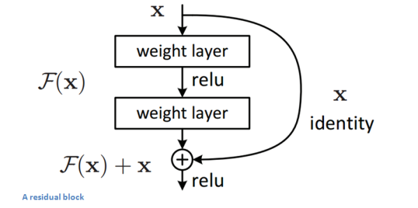

# Meta-algorithms

~~~
\subtitle{Machine Learning and Data Mining}
\author{Maxim Borisyak}

\institute{National Research University Higher School of Economics (HSE)}
\usepackage{amsmath}

\DeclareMathOperator*{\E}{\mathbb{E}}

\DeclareMathOperator*{\var}{\mathbb{D}}
\newcommand\D[1]{\var\left[ #1 \right]}

\DeclareMathOperator*{\argmin}{\mathrm{arg\,min}}
\DeclareMathOperator*{\argmax}{\mathrm{arg\,max}}
~~~

### In the last episode

`\vspace{5mm}`

```python
def data_science(problem_description,
                 domain_expertise=None,
                 *args, **kwargs):
  if problem_description is None:
    raise Exception('Learning is impossible!')

  prior_on_algorithms = \
    data_scientist.world_knowledge.infer(
      problem_description,
      domain_expertise,
      *args, **kwargs
    )
  return prior_on_algorithms
```

### Making algorithms

Constructing learning algorithms from scratch is hard:
- it is the reason people use machine learning instead of classical statistical approach.

`\vspace{5mm}`

- producing tons of simple, rude algorithms is quite easy;
- fitting all-powerful zero-bias classifier is easy.

`\vspace{5mm}`

~~~center
\large
Can an good algorithm be assembled from a set of simple ones?
~~~

## Bootstrap

### Settings

Suppose we have a quite good learning algorithm $f(x, D)$ where:
- $D$ is a dataset,
- $x$ is a point of interest,

with **high variance** and **low bias**.`\\[5mm]`
What is the most common way of decreasing variance of mean estimate of a random variable?

### Bootstrap

Let's consider average over multiple datasets:
$$F(x) = \frac{1}{n}\sum_i f(x, D_i) \approx \E_{D \sim P^n(X, Y)} f(x, D) = \hat{F}(x)$$

If $D_i$ are i.i.d:
- $F(x)$ would reduce variance.

If $D_i$ are correlated (via $f(x, D_i)$):

$$\var\left[\frac{1}{n}\sum_i Z_i\right] = \frac{\sigma^2}{n} \left( 1 + (n - 1)\rho\right) \to_{n \to \infty} \rho$$

where:
- $\var\left[Z_i\right] = \sigma^2$, $\rho = \mathrm{corr}(Z_i, Z_j)$ ($i \neq j$).

### Non-parametric bootstrap

Let's approximate $P(X, Y)$ by $\mathbb{U}\left\{ D \right\}$:
- consider $D_i = \{(x^i_j, y^i_j)\}^{m}_{j = 1}$ drawn i.i.d from $D$ with replacement:
  $$F(x) = \sum_{D_i \sim \mathbb{U}^m\left\{ D \right\}} f(x, D_i)$$
- it will reduce variance.

`\vspace{5mm}`

~~~center
\textbf{\Large Seems like model's variance was reduced for 'free', where is the catch?}
~~~

### Parametric bootstrap

If we have a sacred knowledge then we can:
- **using D produce more accurate** $\hat{P}(X, Y)$ **than** $\mathbb{U}^n\left\{D\right\}$

`\vspace{5mm}`
E.g. for regression:
$$D_i = \{(x_i, y_i + \varepsilon)\}^N_{i = 1}$$
where:
- $\varepsilon \sim \mathcal{N}(0, \sigma_\varepsilon)$

### Parametric bootstrap

> \dots the bootstrap mean is approximately a posterior average \dots

`\vspace{5mm}`

For details:`\\`
Hastie, T., Tibshirani, R. and Friedman, J., 2001. The elements of statistical learning, ser., chapter 8

### Bootstrap
`\vspace{5mm}`


### Bootstrap: a note

Sometimes we can produce more diverse $\{f(x, D_i)\}_i$ by
training on feature subsets.

### Stacking: settings

Bayesian averaging:
- $\zeta$ - variable of our interest (e.g. f(x));
- $\mathcal{M}_m$, $m = 1, \dots, M$ - a candidate models;
- $D$ - training dataset.

~~~multline*
\E(\zeta \mid D) = \\
  \sum_m \E(\zeta \mid \mathcal{M}_m, D) P(\mathcal{M}_m \mid D) = \\
    \sum_m w_m \E(\zeta \mid \mathcal{M}_m, D)
~~~

$w_m = P(\mathcal{M}_m \mid D)$

### Stacking: BIC

$$P(\mathcal{M}_m \mid D) \sim P(\mathcal{M}_m) P(D \mid \mathcal{M}_m)$$

$P(D \mid \mathcal{M}_m)$ can be:
- computed directly;
- estimated by Bayesian Information Coefficient:
$$-\log P(D \mid \mathcal{M}_m) \underbrace{\approx}_{\text{uniform prior}} \frac{1}{2} \mathrm{BIC} =  -\mathrm{LogLik} \frac{d}{2}N + O(1)$$

### Stacking

Frequentist view:

$$\hat{w} = \argmin_w \sum_i\left[ y_i - \sum_m w_m f^{-i}_m(x_i) \right]^2$$

where:
- $f^{-i}_m$ - $m$-th model trained without $i$-th sample.

### Stacking in general

Often the following procedure is referred as stacking:
- base dataset, stacking dataset: $D_b \cap D_s = \varnothing$;
- let $\{ f_m \}_m$ be different models trained on $D_s$;
- train stacking model:
  $$\mathcal{L}_g = \sum_{i \in D_s} l\left( g(f_1(x_i), f_2(x_i), \dots, f_m(x_i)), y_i \right) \to_g \min$$

### Random forest

~~~equation*
\mathrm{RandomForest} = \begin{Bmatrix} \text{sample bagging} \\ + \\ \text{feature bagging} \end{Bmatrix}\left(\text{Decision Tree}\right)
~~~

### Stacking: discussion

- usually stacking model is simple:
  - linear models (e.g. LASSO, Ridge);
  - logistic regression;

- stacking is great:
  - when base model has high variance:
  - i.e. the model is over parametrized;
- can be easily trained in parallel;
- can't make model more complex;
- in practice, often, though as one of the last resorts.

### Calibration

- if base model does not provide proper probability estimates (e.g. SVM, Trees)
- logistic regression (or simple network) over its scores
- trained with proper loss (e.g. cross-entropy)
- can **calibrate** base model.

### Stacking: discussion

~~~center
\textbf{ \Large Why not just use one tree with fewer terminal nodes instead of random forest? }
~~~


## Boosting

### Boosting: settings

Settings:
- a number of simple, **weak** (high bias, low variance) models;
- for simplicity, we consider one big set of models $\mathcal{H} = \{h^i\}_i$:
  - (the most common case) one training procedure.

### Boosting: general idea

Like in stacking we wish to build an ensemble:
$$F(x) = \sum_i \alpha_i h^i(x)$$

Matching pursuit strategy:
- sequentially add models one by one into ensemble:
~~~eqnarray*
F^0 &=& \mathrm{const};\\
h^{t + 1} &=& \argmin_{\alpha; h \in \mathcal{H}} \mathcal{L}(F^t + \alpha_{t + 1} h);\\
F^{t + 1} &=& F^{t} + \alpha h^{t + 1}.
~~~

### AdaBoost

AdaBoost is a classifier, that utilizes exponential loss:

$$\mathcal{L}(f) = \sum_i \exp\left[ -y_i f(x_i)\right]$$

~~~multline*
  \mathcal{L}(F^{t + 1}) =
    \sum_i \exp\left[ -y_i ( F^t(x) + \alpha h(x) )\right] = \\
      \sum_i \exp\left[-y_i F^t(x) \right] \cdot \exp\left[ -y_i \alpha h(x) \right] = \\
        \sum_i w^t_i \exp\left[ -y_i \alpha h(x) \right] \to \min
~~~

### AdaBoost

An interesting properties of AdaBoost:
- training of the sequential classifier is a classification problem;
- if weak classifier return values $\{-1, 1\}$:
  $$\alpha^{t + 1} = \frac{1}{2}\left( \frac{\sum_{i \in \mathrm{correct}} w^t_i}{\sum_{i \in \mathrm{incorrect}} w^t_i} \right)$$
- due to exponential loss AdaBoost tends to everfit quickly;
- proper multiclass formulation can be found in:


> Zhu, J., Zou, H., Rosset, S. and Hastie, T., 2009. Multi-class adaboost. Statistics and its Interface, 2(3), pp.349-360.

### Gradient boosting machine

In general solving:
$$\mathcal{L}(F^{t + 1}) = \mathcal{L}(F^t + \alpha h) \to_{\alpha, h} min$$

might not be tractable.

### Gradient boosting machine

Strategy:

~~~equation
  \mathcal{L}(F^{t + 1}) =
    \sum_i l\left[ y_i, F^t(x) + \alpha h(x) \right] \to \min
~~~

for small $\alpha h(x)$:
  $$\alpha h(x) \approx -\nabla_{F^t} l\left[ y_i, F^t(x) \right]$$

### Gradient boosting machine

- $F^0 = \mathrm{const}$;
- repeat for $t \in 0, \dots, (T - 1)$:
  - compute pseudo-residuals $r^{t + 1}_i = -\nabla_{F^t} l\left[ y_i, F^t(x) \right]$;
  - fit $h^{t + 1}$ to $r^t_i$;
  - compute $\alpha^{t + 1}$.
  - $F^{t + 1} \leftarrow F^t + \alpha^{t + 1} h^{t + 1}$

### GBM: discussion

- $\nabla_{F_t} l\left[ y_i, F_t(x) \right]$ almost always can be computed analytically;
- solving for $$\alpha^{t + 1} = \argmin_\alpha \mathcal{L}(F^t +  \alpha h^{t + 1})$$ is a one-dimensional problem;
- typically, a shrinkage factor $\rho$ is also introduced:
  $$F^{t + 1} \leftarrow F^t + \rho \alpha^{t + 1} h^{t + 1}$$
- sometimes $\alpha$ is just omitted (if $\rho$ is small enough).

## Boosted Decision Trees

### BDT: settings

Boosted Decision Trees is a gradient boosting on decision trees:
- loss: $$\mathcal{L}(F) = \sum_i l(y_i, F(x)) + \Omega(F)$$
  $$\Omega(f_t) = \gamma N^t + \frac{\lambda}{2}\sum^N_{k = 1} w^t_k$$

where:
  - $l$ - cross-entropy loss is commonly used;
  - $\Omega(F) = \sum_t \Omega(f^t)$;
  - $N^t$ - number of leafs in tree $h^t$;
  - $w^t_k$ - prediction of $k$-th leaf of $f^t$.

### BDT

Performing one step of Newton-Raphson:

~~~multline*
  \mathcal{L}(F^t + f) \approx \\[5mm]
    \mathcal{L}(F^t) + \underbrace{\nabla \mathcal{L}(F^t)}_{= \sum_i g^t_i} f + \frac{1}{2} \underbrace{\mathbb{H} \mathcal{L}(F^t)}_{= \sum_i h^t_i} f^2 + \Omega(F^t + h) = \\[5mm]
      \mathcal{L}(F^t) + \sum_i g^t_i h + \frac{1}{2}\sum h^t_i f^2 + \Omega(F^t) + \Omega(f)
~~~

where:
- $\nabla \mathcal{L}(FTt) = \sum_i \nabla_{F^t(x_i)} l(y_i, F^t(x_i))$ - gradient;
- $\mathbb{H}$ - hessian, second derivative;

### BDT

Let's consider each individual leaf $k$:

~~~multline*
  \Delta \mathcal{L}(f) =\sum_i g^t_i f_i + \frac{1}{2}\sum h^t_i f_i^2  + \Omega(f) =\\
    \sum^N_{k = 1} \left[ G_k w_k + \frac{1}{2}(H_k + \lambda) w^2_k \right] + \gamma N
~~~

Solution for $w_k$:
$$w^*_k = - \frac{G_k}{H_k + \lambda}$$

Loss:
$$\mathcal{L}^* = -\frac{1}{2}\sum_k \frac{G^2_k}{H_k + \lambda} + \gamma N$$

### BDT

$$\mathcal{L}^* = -\frac{1}{2}\sum_k \frac{G^2_k}{H_k + \lambda} + \gamma N$$

Splitting criteria:

~~~equation*
\mathrm{gain} = \frac{1}{2} \left[ \frac{G^2_L}{H_L + \lambda} + \frac{G^2_R}{H_R + \lambda} - \frac{G^2_L + G^2_R}{H_L + H_R + \lambda} \right] - \gamma
~~~

### BDT

~~~equation*
\mathrm{gain} = \frac{1}{2} \left[ \frac{G^2_L}{H_L + \lambda} + \frac{G^2_R}{H_R + \lambda} - \frac{G^2_L + G^2_R}{H_L + H_R + \lambda} \right] - \gamma
~~~

Tree growing algorithm:
- for each feature compute $\mathrm{gain}$ of optimal split;
- select best feature with $\mathrm{gain} > 0$, perform split;
- repeat until no features with $\mathrm{gain} > 0$.

### Discussion

- BDT replaces gradient-step with Newton-Raphson step;
- usage of Decision Trees allows for a good training procedure;
- search for split by each feature is a one dimensional problem:
  - $H_L$, $H_R$, $G_L$, $G_R$ can be recomputed efficiently;
- can be parallelized by features;
- BDT uses **regression** trees for classification (just a little bit odd);

### Discussion

- boosting can actually create fundamentally new algorithm:
  - consider Decision Trees as kind of boosting;
- a tons of implementations and modifications:
  - classic: XGBoost;
  - oblivious trees: CatBoost (MatrixNet);
- achieves state-of-the-art results \dots sometimes, blah-blah-blah... No-Free-Lunch.

### Discussion

~~~center
  \textbf{ \Large Why so greedy? }
~~~

### References

- Bishop, C.M., 2006. Pattern recognition and machine learning. springer.
- Friedman, J., Hastie, T. and Tibshirani, R., 2001. The elements of statistical learning (Vol. 1, pp. 241-249). New York: Springer series in statistics.
- Freund, Y., Schapire, R. and Abe, N., 1999. A short introduction to boosting. Journal-Japanese Society For Artificial Intelligence, 14(771-780), p.1612.
- Zhu, J., Zou, H., Rosset, S. and Hastie, T., 2009. Multi-class adaboost. Statistics and its Interface, 2(3), pp.349-360.
- Friedman, J.H., 2001. Greedy function approximation: a gradient boosting machine. Annals of statistics, pp.1189-1232.
- `https://xgboost.readthedocs.io/en/latest/model.html`

## Bonus

### Bonus 1

~~~center
  \textbf{ \Large Is it a good idea to boost logistic regression? }
~~~

### A one-layer neural network



### Almost bagging in Deep Learning



### Boosting (?)



### Boosting and neural networks

~~~center
  \textbf{ \Large If Decision Tree can be viewed as equal to a 2-layer network boosting adds a third layer. }
~~~
