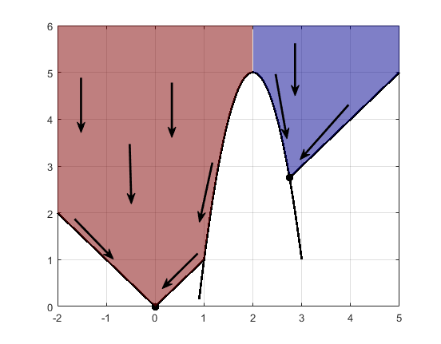

# Optimization in ML

~~~
\subtitle{Machine Learning and Data Mining}
\author{Maxim Borisyak}

\institute{National Research University Higher School of Economics (HSE)}
\usepackage{amsmath}

\DeclareMathOperator*{\E}{\mathbb{E}}

\DeclareMathOperator*{\argmin}{\mathrm{arg\,min}}
\DeclareMathOperator*{\argmax}{\mathrm{arg\,max}}
~~~

## Machine Learning in a nutshell

### ML algorithms

Every (supervised) ML algorithm ever:
- a model $\mathcal{A}$ - set of all possible solutions:
  $$\mathcal{A} \subseteq \{ f: \mathcal{X} \to \mathcal{Y} \}$$
    - $\mathcal{X}$, $\mathcal{Y}$ - sample and target spaces.
- a search procedure:
  $$S: \left(\mathcal{X} \times \mathcal{Y}\right)^n \to \mathcal{A}$$

### ML algorithms

Decision Trees:
- model: piece-wise constant functions;
- search procedure: very sinful one.

SVM:
- linear functions (in some space);
- search procedure: margin maximization.

Logistic regression:
- linear functions;
- search procedure: $\mathrm{cross\text{-}entropy} \to \min$, any optimization method.

In Deep Learning models are often decoupled from search procedures.

### ML algorithms
`\vspace*{3mm}`
Often, model-search can be factorized further:
- parametrized model:
  $$\mathcal{A} = \{ f_\theta : \mathcal{X} \to \mathcal{Y} \mid \theta \in \Theta \subseteq \mathbb{R}^n \}$$
- optimization problem:
  $$L(f_\theta, D) = \mathcal{L}(\theta) \to_\theta \min$$
  - $D \in (\mathcal{X} \times \mathcal{Y})^N$ - training set;
- optimization method $O$:
$$\theta^{t + 1} = O\left[ \theta^t, \mathcal{L} \right].$$

### ML algorithms

- parametrized model:
  - heavily domain/data dependent;
- optimization problem:
  - more or less universal:

~~~equation*
\mathcal{L} =
  \{ \text{log}, \text{hinge}, \dots \}\text{-loss} +
    \{ l_1, l_2 \}\text{-regularization};
~~~

- optimization method $O$:
  - heavily-dependent on nature of $\mathcal{L}$.

### Optimization in ML

Optimization methods:
- heavily restrict:
  - speed of the algorithm:
  - quality of solutions;
- some optimization methods allows for new models:
  - discreet or mixed parameters;
  - variable size models.

## Gradient methods

### The zoo
- SGD, SGD with momentum:
  - you have no memory;
  - you have to write optimizer in 1 minute;
- Nesterov momentum:
  - you want to fine-tune your solution.
- RMSprop:
  - you have little memory and you gradients explode/vanish;
  - you have 2 minutes before submitting your code for training;
- adagrad, adadelta, adam, adamax:
  - methods to go.

*Details are likely to be considered in Deep Learning course.*

## Second-order methods

### Flow chart

Do you have a nearly-quadratic target function?
`\vspace*{5mm}`
  - __yes__: is the problem low-dimensional?
    `\vspace*{3mm}`
    - __yes__: go Newton!
    `\vspace*{3mm}`
    - __no__: use gradient or quasi-Newton methods;
  `\vspace*{5mm}`
  - __no__: use gradient or quasi-Newton methods.

## Hyper-parameter optimization

### Hyper-parameter optimization

Hyper-parameter optimization is a meta-algorithm that operates on union of models parametrized by $\psi$:
  $$\mathcal{A} = \bigcup_\psi \mathcal{A}_\psi = \{ f^\psi_{\theta_\psi} \mid \theta_\psi \in \Theta_\psi \}$$

- outer loss **might differ** from inner loss:
  $$\psi^* = \argmax_\psi Q \left( \argmin_{\theta_\psi} L(\theta_\psi) \right) $$
  - no sacred meaning, just for convinience:
  - example: $L$ - cross-entropy, $Q$ - ROC AUC.

### Hyper-parameter optimization

Outer optimization is usually evaluated on a separate set:
- via train-validation-test split;
- via cross-validation;
- the main reason for split into outer and inner problems.

`\vspace*{5mm}`

Alternatevely, BIC or similar can be used.

`\\[5mm]`

Outer optimization problem is usually non-differentiable:
- number of units, maximal depth of trees.

### Grid-search

Usually, ML algorithms are designed to have **a few**, **non-sensitive** hyper-parameters:
- outer problem is mostly convex and changes slowly;
- grid-search often works perfectly fine.

`\vspace*{5mm}`

Modifications, alternatives:
- randomized grid-search;
- random walk.

## Gradient-free methods

### Gradient-free methods

- local optimization:
  - 'traditional' methods;
- global optimization:
  - gradient and Hessian are fundamentally local properties;
  - evolutionary methods;
- black-box optimization:
  - variational optimization;
  - Bayesian optimization.

### Traditional gradient-free methods

- evaluation of objective function is cheap;
- in practice, **often** can be replaced by gradient-methods:

~~~equation*
\text{cheap} \Rightarrow
  \begin{bmatrix}
    \text{closed-form expression}\\
    \text{or}\\
    \text{allow approximation}
  \end{bmatrix}
  \Rightarrow \text{differentiable}.
~~~

- example: Powell, Nelder-Mead.

### Multi-start

> Just launch local procedure multiple times with different initial guesses.

---

- each local optima acts like an attractor for local methods;
- effective if depth of local optima positively depend on area of attraction.

***



### Evolution methods

> There are just so many...

Basic operations:
- mutation: $x' = x + \mathrm{noise}$;
- crossover: $x' = \mathrm{crossover}(x_1, x_2)$;

`\vspace*{5mm}`

Application:
- you have no idea how to optimize objective function;
- evolution algorithms basically can handle any parametrization:
  - e.g. DNA molecules.

### Memetic algorithms

`\vspace*{5mm}`

```python
def memetic(global_step=evolutionary,
            locally_optimize=annealing):

  population = []
  mature_population = [ <random> ]

  while ...:
    population = global_step(mature_population)
    mature_population = [
      locally_optimize(x) for x in population
    ]
  return mature_population

multistart = lambda locally_optimize:  memetic(
  random_sampling, locally_optimize
)
```

### Black-box optimization

- heavy objective;
- non-differentiable:
  - complex computer simulations (e.g. aero-dynamics);
- so multi-modal, gradient does not have sense:
  - extremely deep networks (e.g. recurrent networks);

### Surrogate optimization
A type of black-box optimization.
`\\[5mm]`

Given known samples $\mathcal{O}^t = \left\{(\theta_i, L_i) \right\}^t_{i = 1}$:
- fit regression (surrogate) model to $\left\{(\theta_i, L_i) \right\}^t_{i = 1}$;
- find the most promising $\theta_{t + 1}$ with conventional optimization methods;
- evaluate objective in $\theta_{t + 1}$;
- $\mathcal{O}^{t + 1} = \mathcal{O}^t \cup \left\{(\theta_{t + 1}, L_{t + 1}) \right\}$;
- repeat.

### Bayesian optimization

The most well-known black-box optimization method.
`\\[5mm]`

Surrogate model:
- must estimate: $P(y \mid D, x)$;
- usually Gaussian processes:
  - easy to handle (normal distribution everywhere);
  - computationally expensive $O(n^3)$, $n$ - number of points.
- possible to use Random Forest or Boosting;
- the most promising point is defined by aquisition function:
  $$a(x) \to \max$$

### Aquisition functions
`\vspace*{3mm}`
- $f'$ - current minimum; $D$ - observed values.

Probability of improvement:
$$a_{pi}(x) = \E\left[ \mathbb{I}[f(x) > f'] \mid D \right] \underbrace{= \Phi(f', \mu(x), K(x, x))}_{GP}$$

Expected improvement:

~~~multline*
a_{ei}(x) = \E\left[ \max(0, f' - f(x)) \mid D \right] = \\ \underbrace{(f' - \mu(x))\Phi(f', \mu(x), K(x, x)) + K(x, x)\phi(f', \mu(x), K(x, x))}_{GP}
~~~

Lower confidence bound:
$$a_{lcb}(x) = \mu(x) + \beta \sigma(x)$$

### Variational optimization

$$\min_x f(x) \leq \E_{x \sim \pi_\psi} f(x) = J(\psi) $$
- $\pi_\psi$ - search distribution;

~~~multline*
\nabla J(\psi) = \nabla \E_{x \sim \pi_\psi} f(x) = \\
  \int_x f(x) \left( \nabla \pi(x \mid \psi) \right) \frac{\pi(x \mid \psi) }{\pi(x \mid \psi) } dx = \\
    \int_x f(x) \nabla \log \pi(x \mid \psi) \pi(x \mid \psi) dx = \\
      \E_{x \sim \pi_\psi} f(x) \nabla \log \pi(x \mid \psi) \approx \\
      \frac{1}{n}\sum^n_{i = 1} f(x_i) \nabla \log \pi(x_i \mid \psi)
~~~

### Evolution Strategies

Evolution Strategies - is a subset of variational optimization (?).

- Repeat:
  - sample $\{x_i\}^n_{i = 1}$ from $\pi(\cdot \mid \psi)$;
  - evaluate $f_i = f(x_i)$;
  - compute:
    $$\nabla J(\psi) \approx \frac{1}{n}\sum^n_{i = 1} f_i \nabla \log \pi(x_i \mid \psi)$$
  - update $\psi$, e.g.
    $$\psi \leftarrow \mathrm{adamax}(\nabla J(\psi))$$

### Evolution Strategies

- $d$ - dimensionality of the problem;
- $\pi_\psi$ - Gaussian:
  - $\mathrm{dim}(\psi) = O(d^2)$: covariance matrix and mean vector;
  - $O(d^3)$ operations per step;
- $\pi_\psi$ - Gaussian with independent components:
  - $|\psi| = O(d)$: diagonal covariance matrix and mean vector;
  - $O(d)$ operations per step;
- $\pi_\psi$ - scaled normal:
  - $|\psi| = O(d)$: variance $\sigma$ and mean vector;
  - $O(d)$ operations per step;
  - less samples for estimating gradient.

## Summary

### Summary

Known your optimization algorithms:
- differentiable $\Rightarrow$ gradient methods;
- super heavy objective $\Rightarrow$ Bayesian;
- non-differentiable $\Rightarrow$ Variational Optimization;
- wierd model $\Rightarrow$ evolutionary optimization.

`\vspace*{5mm}`

~~~center
\textbf{ Don't blindly follow this.}
~~~

### References, gradient-methods

- Bottou, L., 2012. Stochastic gradient descent tricks. In Neural networks: Tricks of the trade (pp. 421-436). Springer Berlin Heidelberg.
- Kingma, D. and Ba, J., 2014. Adam: A method for stochastic optimization. arXiv preprint arXiv:1412.6980.
- Zeiler, M.D., 2012. ADADELTA: an adaptive learning rate method. arXiv preprint arXiv:1212.5701.

### References, quasi-Newton

- Fletcher, R., 2013. Practical methods of optimization. John Wiley  Sons.

### References, gradient-free

- Back, T., 1996. Evolutionary algorithms in theory and practice: evolution strategies, evolutionary programming, genetic algorithms. Oxford university press.
- Kennedy, J., 2011. Particle swarm optimization. In Encyclopedia of machine learning (pp. 760-766). Springer US.
- Wierstra, D., Schaul, T., Glasmachers, T., Sun, Y., Peters, J. and Schmidhuber, J., 2014. Natural evolution strategies. Journal of Machine Learning Research, 15(1), pp.949-980.
- Snoek, J., Larochelle, H. and Adams, R.P., 2012. Practical bayesian optimization of machine learning algorithms. In Advances in neural information processing systems (pp. 2951-2959).
