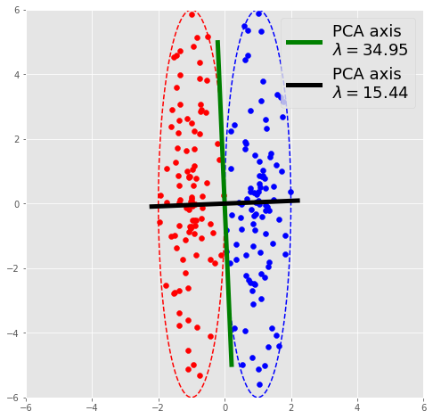
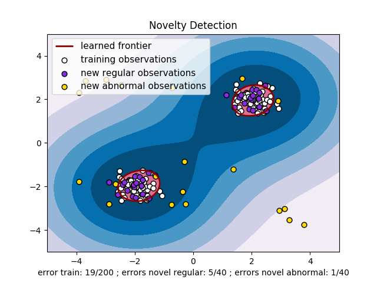

# Practical tricks

~~~
\subtitle{Machine Learning and Data Mining}
\author{Maxim Borisyak}

\institute{National Research University Higher School of Economics (HSE)}
\usepackage{amsmath}

\DeclareMathOperator*{\E}{\mathbb{E}}

\DeclareMathOperator*{\argmin}{\mathrm{arg\,min}}
\DeclareMathOperator*{\argmax}{\mathrm{arg\,max}}
~~~

### Outline

Here, we consider practical problems that are not quite aligned with theory:
- imbalanced datasets;
- differences in training and application domains;
- one-class classification.

## Imbalanced datasets

### Imbalanced datasets

Settings:
- classification problem: $\mathcal{C}^+$ against $\mathcal{C}^-$;
- often in practice $P(\mathcal{C}^+) \ll P(\mathcal{C}^-)$.

This poses several problems:
- mini-batch learning procedures degradate;
  - extreamely slow learning;
- imprecise results.

### Degradation of mini-batch learning

Probability of a example from $\mathcal{C}^+$ being selected into a mini-batch is low:
- $\Rightarrow$ increased $\mathbb{D}[\nabla \mathcal{L}]$;
- $\Rightarrow$ low learning rate;
- $\Rightarrow$ slow learning.

### Changing priors

~~~eqnarray*
  P(\mathcal{C}^+ \mid X) &=& \frac{P(X \mid \mathcal{C}^-) P(\mathcal{C}^-)}{P(X \mid \mathcal{C}^-) P(\mathcal{C}^-) + P(X \mid \mathcal{C}^+) P(\mathcal{C}^+)};\\[5mm]
  \frac{L^+}{L^-} &=& \frac{P(\mathcal{C}^+ \mid X)}{P(\mathcal{C}^- \mid X)}
    = \frac{P(X \mid \mathcal{C}^+) }{P(X \mid \mathcal{C}^-)} \cdot \frac{P(\mathcal{C}^+)}{P(\mathcal{C}^-)}.
~~~

Let $\mathcal{D}[h] = \left\{ \{ x \mid h(x) > \tau\} \mid \tau \in \mathbb{R} \right\}$ i.e. set of decision surfaces.`\\[3mm]`
$f(x) = P(\mathcal{C}^+ \mid X)$ - the ideal classifier for $\mathcal{C}^+$ against $\mathcal{C}^-$.

~~~equation*
  \mathcal{D}[f] = \mathcal{D}\left[\frac{f}{1 - f}\right] = \mathcal{D}\left[\frac{L^+}{L^-}\right] = \mathcal{D}\left[ \frac{P(X \mid \mathcal{C}^+) }{P(X \mid \mathcal{C}^-)} \right]
~~~

### Changing priors

An ideal classifier:
- invariant to change of priors w.r.t. set of decision surfaces;
- change of priors might stabilize and speed up learning;
- **only true for a really good classifiers!**

`\vspace*{5mm}`

Not ideal classifier under change of priors:
- low capacity classifiers might change surfaces significantly;
- dramatic changes of priors may render classifier useless.

### Sampling

- slow convergence is a result high gradient variance;
- which is the result of unstable composition of mini-batches.

Solutions:
- stratified batches (forcing class ratio into batches);
- change in sampling distribution (importance sampling).

### Importance sampling

~~~multline*
  \mathcal{L} = \mathbb{E}_{x, y \sim P_{x, y}} l(f(x), y) = \\
      \int_{x, y} P(x, y) l(f(x), y) d x d y = \\
        \int_{x, y} P'(x, y) \frac{P(x, y)}{P'(x, y)} l(f(x), y) dx dx = \\
          \mathbb{E}_{x, y \sim P'_{x, y}} w(x, y) l(f(x), y).
~~~

$w(x, y) = \frac{P(x, y)}{P'(x, y)}$ - weights.

### Importance sampling

Resampling trick allows to:
- stabilize increase frequency of rare but important samples;
- increase speed of convergence.

`\vspace*{5mm}`

Importance can be predetermined e.g.:
- uniform sampling across classes;
- increased sampling probability of hard examples.

Weights can be computed on the fly e.g. adaptive sampling methods.

## Reweighting

### Reweighting

Settings:
- training set $X$ with distribution $P$;
- target set $X'$ with distribution $P'$ but with absent targets;
- $P(x) \neq P'(x)$, but
- $\mathrm{supp}\,P = \mathrm{supp}\,P'$.

Examples:
- training on results of computer simulations.

### Reweighting

- train a classifier $r(x)$ on $X'$ against $X$:
  $$w(x) = \frac{r(x)}{1 - r(x)} = \frac{P'(x)}{P'(x) + P(x)} \cdot \frac{P'(x) + P(x)}{P(x)} = \frac{P'(x)}{P(x)}$$

`\vspace*{5mm}`

- use output as weights (similar to importance sampling):

~~~equation*
\mathcal{L}_{\mathrm{target}} = \E_{x, y \sim P'} l(f(x), y) = \E_{x, y \sim P} w(x) l(f(x), y)
~~~

### BDT reweighting

Boosting training scheme allows for an especially efficient reweighting algorithm:

- $w^0(x) = 1$
- repeat until new classifier yield random guess performance:
  - train new classifier $f^t$ on $X'$ against $X$ with weights $w^t(x)$;
  - $w^{t + 1}(x) = w^t(x) \frac{f^t(x)}{1 - f^t(x)}$.

## Semi-supervised learning

### Settings

Semi-supervised learning targets cases with a large amount of unlabeled data:
- $\mathcal{D}_\mathrm{supervised} = \{ (x_i, y_i) \}^N_{i = 1}$;
- $\mathcal{D}_\mathrm{unsupervised} = \{ x_i \}^M_{i = 1}$;
- $|\mathcal{D}_\mathrm{unsupervised}| \gg |\mathcal{D}_\mathrm{supervised}|$;
- distributions of $X$ are equal in both datasets.
- also can be used for unbalanced datasets.

### Semi-supervised learning

Common techniques:
- train dimensionality reduction method on $\mathcal{D}_\mathrm{unsupervised}$;
- apply dimensionality reduction to $\mathcal{D}_\mathrm{supervised}$;
- solve supervised problem reduced domain.

Examples:
- feature selection + classifier;
- PCA + classifier.

### Semi-supervised learning

Dimensionality reduction and supervised methods are trained independently:
- conflict of objectives:
  - reducing dimensionality without losses $\neq$ easier supervised problem;
  - information lost in compression might be important for supervised task.

### Conflict of objectives
`\vspace*{5mm}`

### Semi-supervised deep learning

In Deep Learning both objectives (dimensionality reduction and supervised task)
can  be trained simultaneously, e.g.:
- encoder $z = e(x)$;
- decoder $x' = d(z)$;
- classifier $f(z)$

$$\mathcal{L} = \E_{X, Y \sim \mathrm{supervised}} l_1(f(e(x)), y) + \lambda \E_{X \sim \mathrm{unsupervised}} l_2(x, d(e(x)))$$

## One-class classification

### Settings

- training dataset consist only from one class $\mathcal{C}^+$;
- target dataset might contain additional classes.

`\vspace{5mm}`

Examples:
- anomaly detection;
- outlier detection;
- novelty detection.

### One-class classification

Density based:
- decision function: $P(X | \mathcal{C}^+) > \tau$;
- essentially, generative problem;

Distance based:
- well, a distance is employed...
- $d(x, ?) < \tau$.

### One-class SVM

Minimizes volume contained by class:

~~~eqnarray*
  \min \frac{1}{2}\|w\|^2 &+& \frac{1}{\nu n} \sum_i \left[ \xi_i - \rho \right]\\
  \text{subject}&\,&\text{to}\\
  w \phi(x_i) \geq \rho - \xi_i &:& \forall i\\
  \xi_i \geq 0 &:&\forall i
~~~

### One-class SVM

`\vspace{5mm}`

`{\footnotesize Source: sklearn}`

### Dimensionality reduction

The following heuristic might help:
- train an Auto-Encoder $e, d$ on positive class;
- compute distribution of reconstruction errors $P\left[ (x - d(e(x)))^2 \right]$;
- use this distribution as score for one-class classification:
  $$P\left[ (x - d(e(x)))^2 \right] > \tau$$

- Auto-Encoder should be heavily restricted;
- better to use denoising AE:
  $$ \sum_i \left[ x_i - d(e(x_i + \varepsilon)) \right]^2 \to \min $$

### Restricted networks

Some use a network:
- $f(x)$ trained to replicate $y(x) = 1$;
- $f$ is heavily restricted:
  - bottleneck does not allow to learn $y(x) = 1$ for all x.

`\vspace{5mm}`

Examples:
- Radial Basis Networks:
  $$f(x) = \sum_i w_i \exp(-\|x - c_i\|^2)$$

### One against everything

One against everything = semi-supervised + one-class:
- large unlabeled dataset $\mathcal{D}$;
- small positive dataset $\mathcal{C}^+$;
- train positive class against everything:

$$f(x) = \frac{P(X \mid \mathcal{C}^+)}{P(X \mid \mathcal{C}^+) + P(X \mid \mathcal{D})} \sim P(X \mid \mathcal{C}^+)$$

### One against everything

Examples:
- it is easy to sample large amounts of text (e.g. tweets);
- sampling abnormal text might be problematic.

## Summary

### Summary
`\vspace{3mm}`
Imbalanced datasets:
- **be careful with changing priors**;
- resampling.

Importance sampling:
- may improve convergence and stability;
- importance sampling optimization improves convergence rate.

### Summary

Reweighting:
- different training and target distributions of $X$.
- a special case of domain adaptation.

One-class classification:
- a very strange field;
- usually, ill-defined problem.
