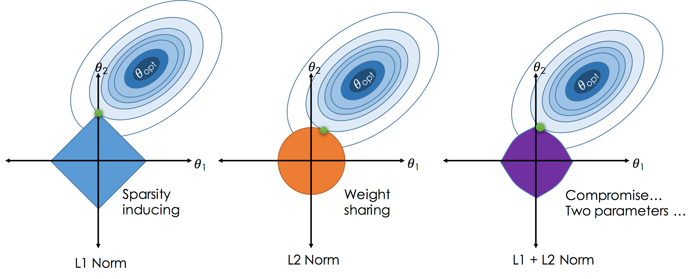
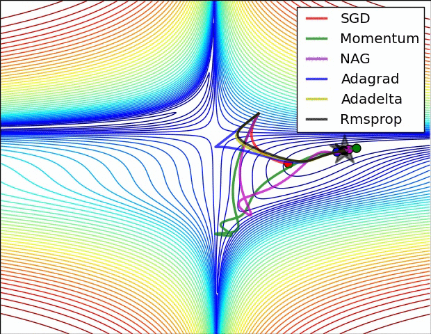
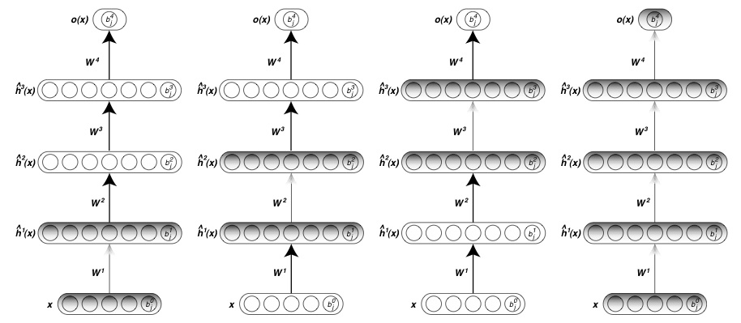
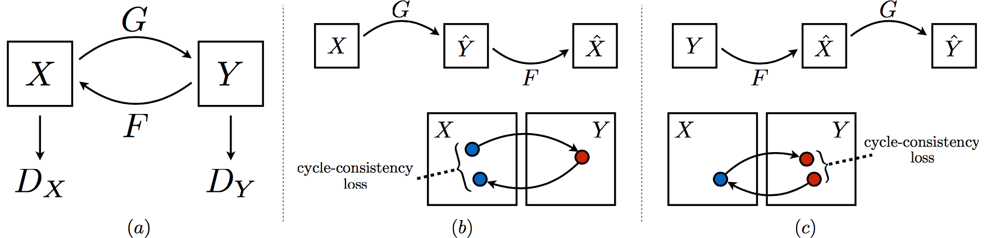
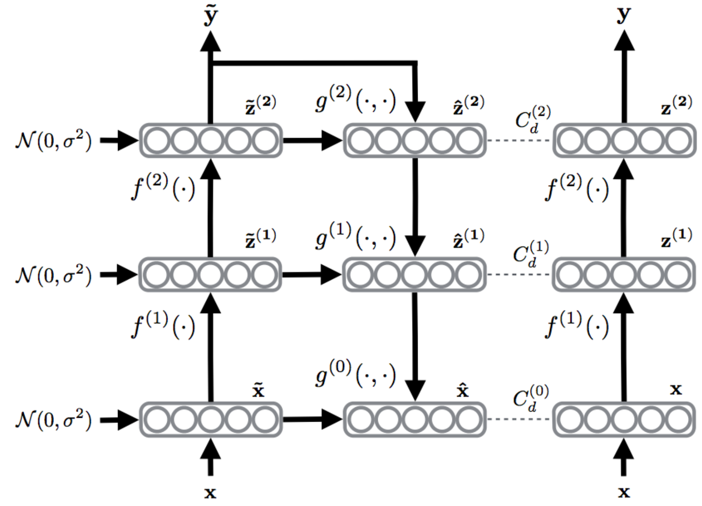
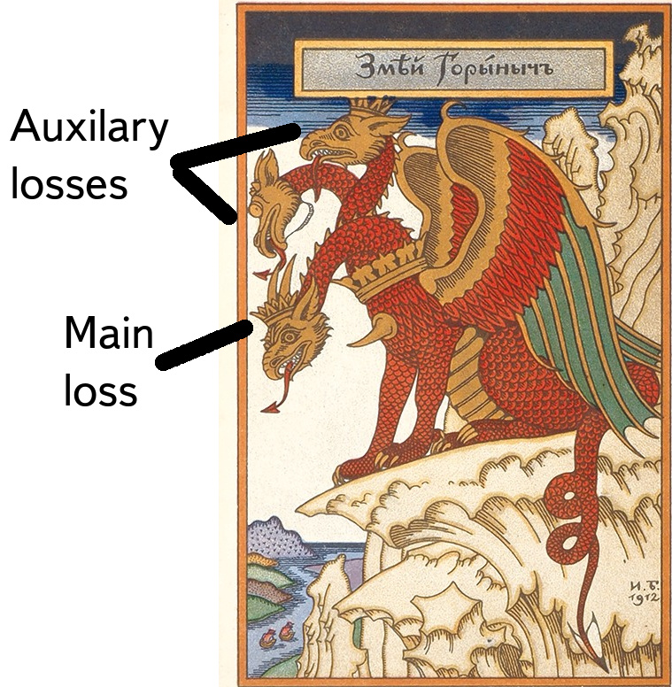

# A deep philosophical note

~~~
\subtitle{Machine Learning and Data Mining}

\usepackage{mathtools}
\usepackage{xcolor}

\author{Maxim~Borisyak}

\institute{
  Yandex Machine Intelligence and Research\\
  National Research University Higher School of Economics
}

\DeclarePairedDelimiter{\ceil}{\lceil}{\rceil}
\DeclarePairedDelimiter\floor{\lfloor}{\rfloor}
~~~

## No-Free-Lunch

### Corollary

A good machine learning family of algorithms/framework:
- has clear relation between hyperparameters and set of problems each algorithm covers;
- i.e. a data scientist can easily map their prior knowledge on hyperparameters.

`\vspace{5mm}`

A great machine learning family/frameworks:
- covers a wide range of problems;
- but each algorithm covers a small set of problems;
- i.e. a lot of sensitive and well-defined hyperparameters.

`\vfill`

`{\footnotesize Here feature engineering/selection/generation is a part of the algorithm.}`

### Traditional ML (simplified)

- analyse the problem and make assumptions;
- pick an algorithm from a toolkit (e.g. logistic regression);
- provide assumptions suitable for the algorithm (**feature engineering**).


### Discussion

- this approach works well for traditional datasets with a small number of features:
- e.g. Titanic dataset:`\\`
~~~center
\begin{tabular}{|c | c | c | c | c | c|}
  \hline
  passenger class & name & gender & age & fare & \dots\\
  \hline
\end{tabular}
~~~

Essentially, performance of the algorithm depends on:
- knowledge of the domain;
- feature engineering skills;
- understanding of assumptions behind standard algorithms.

### Kitten

Let's try to detect kittens!


### Kitten seen by a machine

```python
[[ 22  25  28  32  29 ...,  58  36  35  34  34]
 [ 26  29  30  31  36 ...,  65  38  42  41  42]
 [ 27  28  31  30  40 ...,  84  58  51  52  44]
 [ 27  26  27  29  43 ...,  90  70  60  57  43]
 [ 20  26  28  28  31 ...,  83  73  62  52  45]
 ...,
 [173 187 180 183 184 ..., 170 227 244 219 199]
 [193 199 194 188 185 ..., 181 197 201 209 187]
 [175 177 156 166 171 ..., 226 215 194 185 182]
 [161 159 160 187 178 ..., 216 193 220 211 200]
 [178 180 177 185 164 ..., 190 184 212 216 189]]
```

### Solution?

- edge detection;
- image segmentation;
- eyes, ears, nose models;
- fit nose, ears, eyes;
- average color of segments;
- standard deviation of color segments;
- goodness of fit for segments;
- kitten's face model;
- logistic regression.

### Solution? [plain]


### Solution?

~~~
{
\Large Perhaps, more \underline{Machine} Learning and less Human Engineering?
}
~~~

## Deep Learning

### Deep Learning

~~~
{\Large Let's learn features! }
~~~

### Deep Learning [plain]


### Deep Learning [plain]


### Kitten

**Traditional approach:**
- edge detection;
- image segmentation;
- fit nose, ears, eyes;
- average, standard deviation of segment color;
- fluffiness model;
- kitten's face model;
- logistic regression.

***

**Deep Learning:**
- non-linear function;
- another non-linear function;
- non-linear function, again;
- non-linear function, and again;
- non-linear function (why not?);
- logistic regression.

### Deep Learning

- is not a superior algorithm;
- is not even a single algorithm;
- is a __framework__;
- __allows to express assumptions in much more general way__.

### Why DL rocks

- can crack much harder problems;
  -  it is easier to formulate models for features than features itself;
- easy to construct networks:
  - merge together;
  - bring new objectives;
  - inject something inside network;
  - build networks inside networks;
  - __any differentiable magic is allowed__$^{*}$.

`\vfill`
`{\footnotesize $^{*}$ Non-differentiable also, but with a special care.}`

### Example

A problem contains groups of features:
- image;
- sound features;

Prior knowledge:
- features from different group should not interact directly;

Example of a solution:
- build a subnetwork upon each group of features;
- merge them together.

***


## Almost Free Lunch

### Disclaimer

~~~
{\Large
  This is not a comprehensive overview of Deep Learning, just some more-or-less colorful examples.
}
~~~

### Hacking layers

- restrictions on weights: convolutions, weight matrix decomposition, ...;
- activation: ReLU, ELU, SELU, ...;
- new operations: pooling, maxout, ...;
- specific unit behaviour: GRU, LSTM units, ...

### Hacking model [plain]

Restrictions on search space:
- regularization, e.g.:
  $$\mathcal{L} = \mathcal{L}_{\mathrm{cross-entropy}} + \alpha \|W\|^2_2$$



### Hacking search procedure

- SGD-like methods:
 - adam, adadelta, adamax, rmsprop;
 - nesterov momentum;
- quasi-Newton methods;
- batch normalization, weight normalization;
- weight matrix decomposition.

***



### Data augmentation
- symmetries: shifts, rotations, ...:
  - searching for a network that produces the same response for shifted/rotated samples;
  - eliminating symmetries;
- random noise:
  - pushing separation surface farther from samples - robust output;

### Hacking model

Interference with network (change of objective):
- drop-out, drop-connect:
  - searching for a robust network.


### Hacking loss

Hacking objectives:
- introducing loss for each layer:
  $$\mathcal{L} = \mathcal{L}_n + \sum^{n - 1}_{i = 1} C_i \mathcal{L}_i$$
where:
  - $\mathcal{L}_i$ - loss on $i$-th layer.
- Deeply Supervised Networks:
  - searches for network that obtains good intermediate results.

### Hacking initial guess

Pretraining:
- unsupervised pretraining;
- greedy layer-wise pretraining with e.g. AutoEncoders.



### Hacking architecture: U-net [plain]

- skip connections allow to combine context with low-level representation.


### Hacking architecture: ResNet [plain]

- residual connections produce boosting-like behaviour;
- no vanishing gradients;
- brute-force: up to 1000+ layers.


### Hacking architecture: Cycle-GAN [plain]

- reverse transformation;
- symmetric discrimination.




### Hacking architecture: Ladder Net [plain]

- introduces auxiliary task: denoising;




## Breaking No Free Lunch

### Auxilary task [plain]

- introducing additional task for a network might considerably improve generalization:
$$\mathcal{L} = \mathcal{L}_\mathrm{main} + \alpha \mathcal{L}_\mathrm{auxilary}$$

- e.g. along with particle identification restore momentum;
- brings additional information.

***
`\vspace{-10mm}`


### Pretraining

- pretraining on a similar dataset;
  - as initial guess;
  - regularization relative to another model $\{ W^0_i \}^{n}_{i = 1}$:
    $$\mathcal{L} = \mathcal{L}_\mathrm{main} + \lambda \sum^{n}_{i = 1} \|W_i - W^0_i\|^2_2$$
- using weights from the zoo;
- unsupervised pretraining (semi-supervised learning).

## Summary

### Summary

No Free Lunch theorem:
- Machine Learning is about using prior knowledge about the problem wisely.

Deep Learning:
- a framework that covers a large range of problems;
- allows to express prior knowledge freely;
- makes it easier to solve hard problems.

### References

No-Free-Lunch theorem:
- Schaffer, Cullen. "A conservation law for generalization performance." Proceedings of the 11th international conference on machine learning. 1994.
- Wolpert, David H. "The supervised learning no-free-lunch theorems." Soft computing and industry. Springer London, 2002. 25-42.
- Wolpert, David H., and William G. Macready. "No free lunch theorems for optimization." IEEE transactions on evolutionary computation 1.1 (1997): 67-82.

### References: layers

- Clevert, Djork-Arné, Thomas Unterthiner, and Sepp Hochreiter. "Fast and accurate deep network learning by exponential linear units (elus)." arXiv preprint arXiv:1511.07289 (2015).
- Goodfellow, Ian J., et al. "Maxout networks." arXiv preprint arXiv:1302.4389 (2013).
- Chung, Junyoung, et al. "Gated feedback recurrent neural networks." International Conference on Machine Learning. 2015.

### References: regularization

- Sainath, Tara N., et al. "Low-rank matrix factorization for deep neural network training with high-dimensional output targets." Acoustics, Speech and Signal Processing (ICASSP), 2013 IEEE International Conference on. IEEE, 2013.
- Srivastava, Nitish, et al. "Dropout: a simple way to prevent neural networks from overfitting." Journal of Machine Learning Research 15.1 (2014): 1929-1958.
- Lee, Chen-Yu, et al. "Deeply-supervised nets." Artificial Intelligence and Statistics. 2015.

### References: network architectures

- Von Eicken, Thorsten, et al. "U-Net: A user-level network interface for parallel and distributed computing." ACM SIGOPS Operating Systems Review. Vol. 29. No. 5. ACM, 1995.
- He, Kaiming, et al. "Deep residual learning for image recognition." Proceedings of the IEEE conference on computer vision and pattern recognition. 2016.
- Zhu, Jun-Yan, et al. "Unpaired image-to-image translation using cycle-consistent adversarial networks." arXiv preprint arXiv:1703.10593 (2017).
- Rasmus, Antti, et al. "Semi-supervised learning with ladder networks." Advances in Neural Information Processing Systems. 2015.

### More resources

A lot of useful links can be found in:
- Schmidhuber, Jürgen. "Deep learning in neural networks: An overview." Neural networks 61 (2015): 85-117.
- Bengio, Yoshua. "Learning deep architectures for AI." Foundations and trends® in Machine Learning 2.1 (2009): 1-127.
