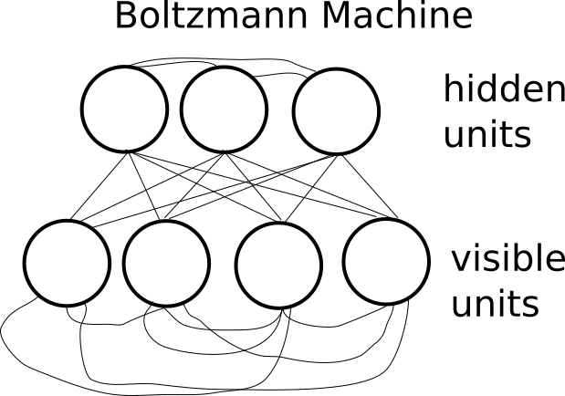
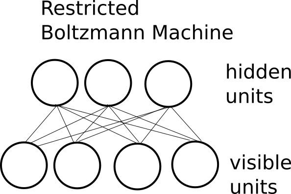
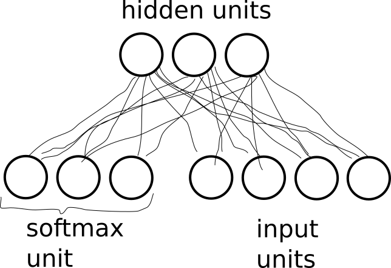
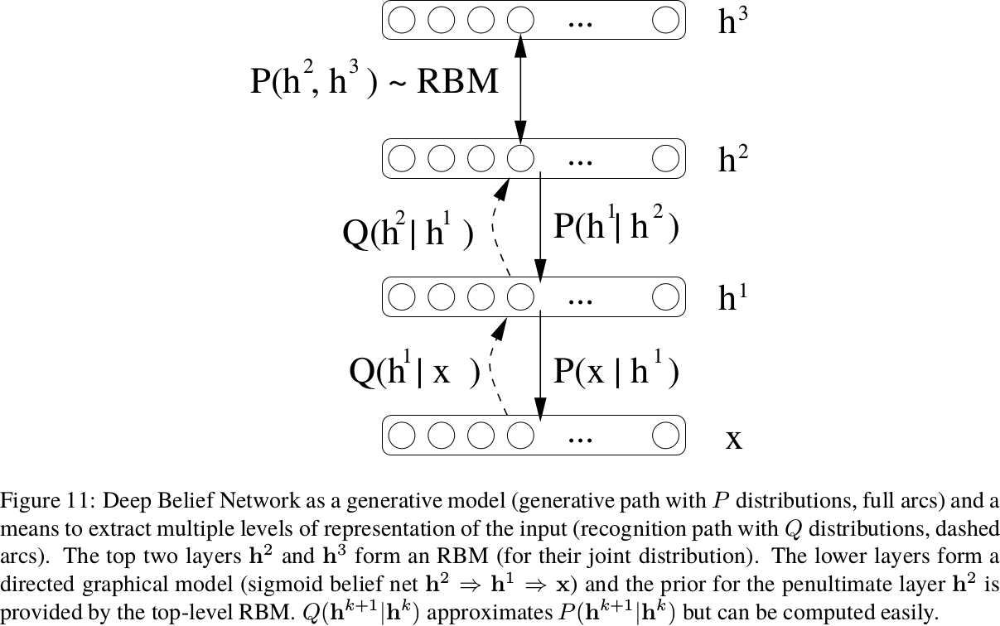

# Restricted Boltzmann Machine

~~~
\subtitle{Machine Learning and Data Mining}
\author{Maxim Borisyak}

\institute{National Research University Higher School of Economics (HSE)}
\usepackage{amsmath}

\DeclareMathOperator*{\E}{\mathbb{E}}

\DeclareMathOperator*{\var}{\mathbb{D}}
\newcommand\D[1]{\var\left[ #1 \right]}

\DeclareMathOperator*{\argmin}{\mathrm{arg\,min}}
\DeclareMathOperator*{\argmax}{\mathrm{arg\,max}}
~~~

## Generative models

### Generative models

- Informally, given samples we wish to learn generative procedure.
- Formally, given samples of a random variable $X$, we wish to find $X'$, so that:
$$P(X) \approx P(X')$$

### Sampling generative models

- direct sampling procedure, usually in form:

~~~eqnarray*
  X &=& f(Z);\\[5mm]
  Z &\sim& U^n[0, 1] \\
  &\text{\;or\;}& \\
  Z &\sim& \mathcal{N}^n[0, 1];
~~~

- density is usually unknown, since:

$$p(x) = \sum_{z \mid f(z) = x} p(z) \left| \frac{\partial}{\partial z} f(z) \right|^{-1}$$

### Density generative models

- density function $P(x)$ or unnormalized density function:

$$P(x) = \frac{1}{C}\rho(x)$$

- sampling is usually done via some kind of Monte-Carlo Markov Chains (possible for unnormalized density).

## Boltzmann machines

### Energy models

$$P(x) = \frac{1}{Z} \exp(-E(x))$$

where:
- $E(x)$ - **energy function**;
- $Z = \sum_{x} \exp(-E(x))$ - normalization constant, **partition function**.

### Latent variables

- one of the simplest way to model a complex distribution is via hidden or *latent* variables $h$:

~~~eqnarray*
  P(x, h) &=& \frac{1}{Z} \exp(-E(x, h));\\
  P(x) &=& \frac{1}{Z} \exp(-E(x));\\
  E(x) &=& \mathrm{FreeEnergy}(x) = -\log \sum_{h} \exp(-E(x, h));\\
  Z &=& \sum_x \exp(-\mathrm{FreeEnergy}(x)).
~~~

### Maximum Likelihood fit

~~~equation*
  \mathcal{L} = \sum_i \log P(x_i) \to \max;
~~~

~~~multline*
  \frac{\partial}{\partial \theta} \log P(x) = \\
    \frac{\partial}{\partial \theta} \log \left[ \frac{1}{Z} \exp(-\mathrm{FreeEnergy}(x)) \right] =\\
      - \frac{\partial}{\partial \theta} \log {Z} - \frac{\partial}{\partial \theta} \mathrm{FreeEnergy}(x) = \\
      - \frac{1}{Z} \frac{\partial}{\partial \theta} Z  - \frac{\partial}{\partial \theta}\mathrm{FreeEnergy}(x) = \\
        - \frac{1}{Z} \frac{\partial}{\partial \theta} \left[ \sum_\chi \exp(-\mathrm{FreeEnergy}(\chi)) \right] -  \frac{\partial}{\partial \theta} \mathrm{FreeEnergy}(x)
~~~

### Maximum Likelihood fit

~~~multline*
\frac{\partial}{\partial \theta} \log P(x) = \\
  - \frac{1}{Z} \frac{\partial}{\partial \theta} \left[ \sum_\chi \exp(-\mathrm{FreeEnergy}(\chi)) \right] - \frac{\partial}{\partial \theta} \mathrm{FreeEnergy}(x) = \\
   \sum_\chi \frac{1}{Z} \exp(-\mathrm{FreeEnergy}(\chi)) \frac{\partial}{\partial \theta}\mathrm{FreeEnergy}(\chi) -
     \frac{\partial}{\partial \theta} \mathrm{FreeEnergy}(x) = \\
      \sum_\chi P(\chi) \frac{\partial}{\partial \theta} \mathrm{FreeEnergy}(\chi) - \frac{\partial}{\partial \theta} \mathrm{FreeEnergy}(x)
~~~

### Maximum Likelihood fit

~~~equation*
\frac{\partial}{\partial \theta} \log P(x) = \sum_\chi P(\chi) \frac{\partial}{\partial \theta} \mathrm{FreeEnergy}(\chi) - \frac{\partial}{\partial \theta} \mathrm{FreeEnergy}(x)
~~~

`\vspace{5mm}`

~~~equation*
\mathbb{E}_{x} \left[ \frac{\partial}{\partial \theta} \log P(x)\right] =
    \mathbb{E}_{\chi} \left[\frac{\partial}{\partial \theta} \mathrm{FreeEnergy}(\chi)\right] - \mathbb{E}_{x} \left[\frac{\partial}{\partial \theta} \mathrm{FreeEnergy}(x)\right]
~~~

`\vfill`

where:
- $x$ - sampled from `real' data;
- $\chi$ - sampled from current model.

### Maximum Likelihood fit

~~~equation*
\Delta \theta \sim \frac{\partial}{\partial \theta} \mathrm{FreeEnergy}(\chi) - \frac{\partial}{\partial \theta} \mathrm{FreeEnergy}(x)
~~~

Energy model can be trained by:
- sampling $x$ from given data;
- sampling $\chi$ from the current model;
- following difference between deriviatives of $\mathrm{FreeEnergy}$.

`\vspace{5mm}`

This is known as **contrastive divergence**.

### Latent variables

~~~multline*
  \frac{\partial}{\partial \theta} \mathrm{FreeEnergy}(x) = \\
    -\frac{\partial}{\partial \theta} \left[ \log \sum_h \exp(-E(x, h)) \right] = \\
    \frac{1}{\sum_h \exp(-E(x, h))} \left[ \sum_h \exp(-E(x, h))  \frac{\partial}{\partial \theta} E(x, h) \right] =\\
      \frac{1}{\frac{1}{Z}\sum_h \exp(-E(x, h))} \left[ \frac{1}{Z} \sum_h \exp(-E(x, h))  \frac{\partial}{\partial \theta} E(x, h) \right] =\\
        \frac{1}{\sum_h P(x, h)} \left[ \sum_h P(x, h)  \frac{\partial}{\partial \theta} E(x, h) \right] = \\
          \mathbb{E}_h\left[  \frac{\partial}{\partial \theta} E(x, h) \;\middle\vert\; x \right]
~~~

### Maximum Likelihood fit

~~~equation*
\Delta \theta \sim \frac{\partial}{\partial \theta} \mathrm{Energy}(\chi, h') - \frac{\partial}{\partial \theta} \mathrm{Energy}(x, h)
~~~

Energy model can be trained by:
- sampling $x$ from given data and sampling $h$ from $P(h \mid x)$;
- sampling $\chi$ from the current model and sampling $h'$ from $P(h \mid \chi)$;
- following difference between deriviatives of $\mathrm{Energy}$.

### Gibbs sampling

> Sampling $x = (x^1, x^2, \dots, x^n) \in \mathbb{R}^n$ from $P(x)$.

`\vspace{5mm}`

Repeat until the end of the time:
- for $i$ in $1, \dots, n$:
  - $x^i := \mathrm{sample\;from\;} P(X^i \mid X^{-i} = x^{-i})$

where:
- $x^{-i}$ - all components of $x$ except $i$-th.

### Boltzmann machine

Model with energy function:

~~~eqnarray*
E(x, h) &=& -b^T x -c^T h - h^T W x - x^T U x - h^t V h;
~~~

is called **Boltzmann machine**.`\\[5mm]`
If $\mathrm{diag}(U) = 0$ and $\mathrm{diag}(V) = 0$ then $x$ and $h$ are binomial: $x_i, h_j \in \{0, 1\}$.

### Training Boltzmann machine

`\vspace{5mm}`

Let $s = (x, h)$, then:

$$E(s) = -d^T s - s^T A s$$

then for binomial units:

~~~multline*
P\left(s^i = 1\mid S^{-i} = s^{-i} \right) = \\[3mm]
  \frac{\exp\left(-E\left(s^i = 1, s^{-i}\right)\right)}{\exp\left(-E\left(s^i = 1, s^{-i}\right)\right) + \exp\left(-E\left(s^i = 0, s^{-i}\right)\right)} = \\[3mm]
    \sigma\left(d_i + 2 a^{-i} s^{-i}\right)
~~~

where:
- $a^{-i}$ - $i$-th row without $i$-th element;
- $\sigma(x)$ - sigmoid function.

### Training Boltzmann machine

**Positive phase**:
- sample $x$ from real data;
- perform Gibbs sampling of $h$ under fixed $x$;

`\vspace{5mm}`
**Negative phase**:
- init Gibbs chain with $x$;
- sample both $\chi$ and $h'$ from the model.

`\vspace{5mm}`
$$\Delta \theta = \frac{\partial}{\partial \theta} \mathrm{Energy}(x, h) - \frac{\partial}{\partial \theta} \mathrm{Energy}(\chi, h')$$

### Boltzmann machine: discussion

- two MCMC chains (positive and negative) for each step of SGD;
- training is slow...

## Restricted Boltzmann machine

### Product of experts

`\vspace{5mm}`
Consider energy function in form of **product of experts**:
$$E(x, h) = -\beta(x) + \sum_i \gamma(x, h_i)$$

~~~multline*
P(X) =
  \frac{1}{Z} \sum_h \exp(-E(x, h)) = \\
  \frac{1}{Z} \sum_h \exp(\beta(x))\exp(-\sum_i \gamma(x, h_i)) = \\
  \frac{1}{Z} \exp(\beta(x)) \sum_h \prod_i \exp(-\gamma(x, h_i)) = \\
  \frac{1}{Z} \exp(\beta(x)) \prod_i \sum_{h_i} \exp(-\gamma(x, h_i)).
~~~

### Product of experts

`\vspace{5mm}`
Consider energy function in form of **product of experts**:

~~~eqnarray*
E(x, h) &=& -\beta(x) + \sum_i \gamma(x, h_i);\\
\mathrm{FreeEnergy}(x) &=& -\beta(x) - \sum_i \log \sum_{h_i} \exp(-\gamma(x, h_i)).
~~~

### Product of experts

Pros:
- efficient computing procedure for $\mathrm{FreeEnergy}(x)$;
- each component of $h$ can be sampled independently.

Cons:
- a special case.

### Restricted Boltzmann machine

Restricted Boltzmann machine forbids interactions:
- within visible variables;
- within hidden variables.

`\vspace{5mm}`

$$E(x, h) = \sum_j \phi_j(x_j) + \sum_i \xi(h_i) + \sum_{i, j}\eta_{ij}(x_j, h_i)$$

which can be rewritten simply as:

$$E(x, h) = \sum_{i, j}\eta_{ij}(x_j, h_i)$$

### RBM as NN

***

### Gibbs sampling for RBM

`\vspace*{5mm}`

- each component of $h$ given $x$ (and vice versa) can be sampled independently;
- whole vector of hidden or visible units can be sampled simultaneously;
- e.g. for binomial hidden variables:

~~~multline*
P(h^{k} = 1 \mid X = x) = \\
  \frac{\exp\left[ -\sum_j \eta_{kj}(x_j, 1) \right]}{\exp\left[-\sum_j \eta_{kj}(x_j, 0) \right] + \exp\left[-\sum_j \eta_{kj}(x_j, 1) \right]}
~~~

~~~multline*
P(x^{l} = 1 \mid H = h) = \\
  \frac{\exp\left[ -\sum_i \eta_{il}(1, h_i) \right]}{\exp\left[ -\sum_i \eta_{il}(0, h_i) \right] + \exp\left[ -\sum_i \eta_{il}(1, h_i) \right]}
~~~

### Gibbs sampling for RBM

Gibbs sampling for RBM is especially simple:

~~~eqnarray*
h^0 &\sim& P(H \mid X = x^0);\\
x^1 &\sim& P(X \mid H = h^1);\\
h^1 &\sim& P(H \mid X = x^1);\\
x^2 &\sim& P(X \mid H = h^2);\\
\dots\\
h^{k - 1} &\sim& P(H \mid X = x^{k - 1});\\
x^k &\sim& P(X \mid H = h^{k - 1});\\
h^k &\sim& P(H \mid X = x^k);
~~~

### CD-k update

Free energy version:
- sample $x^0$ from real data;
- compute $\frac{\partial}{\partial \theta} \mathrm{FreeEnergy}(x^0)$;
- initialize Gibbs chain with $x^0$, perform $k$ steps of Gibbs sampling to obtain $x^k$;
- compute $\frac{\partial}{\partial \theta} \mathrm{FreeEnergy}(x^k)$;
- update step:
  $$\theta := \theta + \alpha\left[ -\frac{\partial}{\partial \theta} \mathrm{FreeEnergy}(x^0) + \frac{\partial}{\partial \theta} \mathrm{FreeEnergy}(x^k) \right]$$

### CD-k update

Energy version:
- sample $x^0$ from real data;
- initialize Gibbs chain with $x^0$, sample $h^0$;
- compute $\frac{\partial}{\partial \theta} \mathrm{Energy}(x^0, h^0)$;
- perform further $k$ steps of Gibbs sampling to obtain $h^k, x^k$;
- compute $\frac{\partial}{\partial \theta} \mathrm{Energy}(x^k, h^k)$;
- update step:
  $$\theta := \theta + \alpha\left[ -\frac{\partial}{\partial \theta} \mathrm{Energy}(x^0, h^0) + \frac{\partial}{\partial \theta} \mathrm{Energy}(x^k, h^k) \right]$$

### Justification of CD-k update

For Gibbs chain
$$x^0 \rightarrow h^0 \rightarrow x^1 \rightarrow h^1 \rightarrow \dots$$

~~~multline*
\frac{\partial}{\partial \theta} \log P(x^0) = \\
  -\frac{\partial}{\partial \theta} \mathrm{FreeEnergy}(x^0) +
    \mathbb{E}\left[ \frac{\partial}{\partial \theta} \mathrm{FreeEnergy}(x^t) \right] + \\
      \mathbb{E}\left[ \frac{\partial}{\partial \theta} \log P(x^t) \right];
~~~

~~~equation*
  \mathbb{E}\left[ \frac{\partial}{\partial \theta} P(x^t) \right] \to 0, \text{as\;} t \to \infty
~~~

### CD-$1/2$

Consider truncated Gibbs chain $x^0 \rightarrow h^0$:

~~~multline*
\frac{\partial}{\partial \theta} \log P\left(x^0\right) =
    \mathbb{E}\left[ \frac{\partial}{\partial \theta} P\left(x^0 \mid h^1\right) \right] +
      \mathbb{E}\left[ \frac{\partial}{\partial \theta} \log P\left(h^1\right) \right];
~~~

Using mean-field approximation:

~~~equation*
  \mathbb{E}\left[ \frac{\partial}{\partial \theta} P\left(x^0 \mid h^1\right) \right] \approx \frac{\partial}{\partial \theta} P\left(x^0 \mid \mathbb{E} h^1\right)
~~~

and ignoring the second term we end up optimizing **reconstruction error**:

~~~equation*
  \mathcal{L} = -\log P\left(x^0 \mid \mathbb{E} h^0\right)
~~~

### Bernulli-Bernulli RBM

~~~eqnarray*
E(x, h) &=& -b^T x - c^T h - h^T W x;\\
P(h \mid x) &=& \sigma\left( c + W x \right);\\
P(x \mid h) &=& \sigma\left( b + W^T h \right);
~~~

### Types of units

`\vspace{5mm}`

- binomial unit $u$ with total input x:
  $$P(u = 1 \mid x) = \sigma(x);$$

- multinomial (softmax) unit:
  $$P(u = k \mid x) = \frac{\exp(x_k)}{\sum_i \exp(x_i)};$$

- rectified linear unit: infinite series of binomial units with shared connection and different biases:

~~~eqnarray*
u(x) &\sim& \sum_i \mathrm{binomial}\left(x -\frac{1}{2} + i \right);\\
u(x) &\sim& \max\left[0, x + \mathcal{N}(0, \sigma(x))\right];\\
P(u = k \mid x) &\approx& \log \left(1 + e^x\right).
~~~

### Types of units

- Gaussian visible units:
  $$E(x, h) = \sum_i \frac{(x_i - b_i)^2}{2 \sigma_i^2} - \sum_j c_j h_j - \sum_{ij} h_j W_{ij} \frac{x_i}{\sigma_i} $$
- Gaussian-Gaussian RBM:
  $$E(x, h) = \sum_i \frac{(x_i - b_i)^2}{2 \sigma_i^2} - \sum_j \frac{(h_j - c_j)^2}{2 \sigma_j} - \sum_{ij} \frac{h_j}{\sigma_j} W_{ij} \frac{x_i}{\sigma_i} $$

- $\sigma$ can be learned, but it makes optimization hard;
- usually each input feature is scaled to have zero mean and unit variance, $\sigma$ is fixed to 1.

### Weight decay

Introducing $l_2$ regularization on $W$ leads to *weight decay*:
- faster mixing (convergence) of MCMC chain;
- thus, faster training.

Introducing $l_1$ on *activation* of hidden units leads to sparse RBM:
- presumably, easier interpretation;
- e.g. for visual data learns localized features.

## RBM for discrimination

### As a feature extractor

- train RBM on $X$ to obtain hidden units $h_i$;
- train a discriminative model on $h_i \rightarrow \hat{y}_i$.

Possible applications:
- reducing dimensionality (somewhat equivalent to e.g. AE):
  - high-dimensional inputs;
  - small number of training samples;
- ...

Cons:
- there are a number of more fancier and simpler techniques.

### Discriminative RBM

- train RBM to recover joint distribution $P(x, y)$;

$$f(x) = \frac{\exp\left[ -\mathrm{FreeEnergy}( k, x) \right]}{\sum_i \exp\left[ -\mathrm{FreeEnergy}(i, x) \right]}$$

- visible units can be divided into two groups:
  - it is possible to use different types of units for each group;
  - softmax unit, probably, the best choice for class unit.

***

## Deep Belief Networks

### Deep Belief Networks

### Deep Belief Networks

- Greedy training:
  - usually, trained in a greedy manner: each pair of layers is trained as an RBM.
  - then, fine-tuned with back-propagation w.r.t to a supervised criteria.
- Sleep-Wake algorithm;
- transform DBN into Deep Boltzmann machine.

## Summary

### Summary

Restricted Boltzmann Machine:
- is an undirected two-layer energy-based generative model;
- can be trained by Contrastive Divergence;
- is a building block of Deep Belief Network.

### References I

- Bengio Y. Learning deep architectures for AI. Foundations and trends® in Machine Learning. 2009 Nov 15;2(1):1-27.
- Hinton GE, Osindero S, Teh YW. A fast learning algorithm for deep belief nets. Neural computation. 2006 Jul;18(7):1527-54.
- Nair V, Hinton GE. Rectified linear units improve restricted boltzmann machines. InProceedings of the 27th international conference on machine learning (ICML-10) 2010 (pp. 807-814).

### References II

- Hinton G. A practical guide to training restricted Boltzmann machines. Momentum. 2010 Aug 2;9(1):926.
- Tieleman T. Training restricted Boltzmann machines using approximations to the likelihood gradient. InProceedings of the 25th international conference on Machine learning 2008 Jul 5 (pp. 1064-1071). ACM.
