# Generative Adversarial Networks

~~~
\subtitle{Machine Learning and Data Mining}
\author{Maxim Borisyak}

\institute{National Research University Higher School of Economics (HSE)}
\usepackage{amsmath}

\usepackage{algorithm}
\usepackage{algpseudocode}

\DeclareMathOperator*{\E}{\mathbb{E}}

\DeclareMathOperator*{\var}{\mathbb{D}}
\newcommand\D[1]{\var\left[ #1 \right]}

\newcommand\dmid{\,\|\,}

\DeclareMathOperator*{\argmin}{\mathrm{arg\,min}}
\DeclareMathOperator*{\argmax}{\mathrm{arg\,max}}
~~~

## Generative models

### Generative models

- Informally, given samples we wish to learn underlying distribution in form of sampling procedure.
- Formally, given samples of a random variable $X$, we wish to find $X'$, so that:
$$P(X) \approx P(X')$$

### Types of generative models

Fitting density function $P(X)$ (or a function $f(x)$ proportional to the density):
- partition function $Z$ for $f(x)$ might be an issue:
  - for energy models Contrastive Devergence keeps $Z$ finite (ideally constant);
- sampling might be an issue:
  - Gibbs sampling works ok if $P(x^i \mid x^{-i})$ is analytically known and simple enough.

Going deep:
- RBM is intrinsically one-layer model;
- Deep Boltzmann machines:
  - Gibbs sampling becomes less efficient than for RBM.

### Types of generative procedures

Options for defining a random variables:
- specify $P(X)$ and use general sampling algorithm (e.g. Gibbs sampling);
- **learn sampling procedure directly**, e.g.:

~~~eqnarray*
  X &=& f(Z);\\
  Z &\sim& \mathrm{SimpleDistribution};
~~~

### Fitting Distributions

> Notation: $Q$ - ground truth distribution, $P$ - model.

Maximum Likelihood:

~~~eqnarray*
  \mathcal{L} &=& \sum_i \log P(x_i) \approx \E_{x \sim Q} \log P(x) \to_P \min;\\
  \mathrm{KL}(Q \dmid P) &=& \E_{x \sim Q} \log Q(x) - \E_{x \sim Q} \log P(x) \to_P \min.
~~~

Jensen-Shannon distance:

~~~eqnarray*
  \mathrm{JS}(P, Q) &=& \frac{1}{2} \left[ \mathrm{KL}(P \dmid M) + \mathrm{KL}(Q \dmid M) \right] \to_P \min;\\
  M &=& \frac{1}{2}(P + Q).
~~~

## Generative Adversarial Networks

### Approximating JS distance

~~~multline*
  \mathrm{JS}(P, Q) = \frac{1}{2}\left[ \E_{x \sim P} \log \frac{P(x)}{M(x)} + \E_{x \sim Q} \log \frac{Q(x)}{M(x)} \right] =\\[5mm]
    \frac{1}{2}\left[ \E_{x \sim P} \log \frac{P(x)}{P(x) + Q(x)} + \E_{x \sim Q} \log \frac{Q(x)}{P(x) + Q(x)} \right] + \log 2 =\\[5mm]
    \E_{x \sim M} \frac{P(x)}{P(x) + Q(x)} \log \frac{P(x)}{P(x) + Q(x)} + \\[3mm] \E_{x \sim M} \frac{Q(x)}{P(x) + Q(x)} \log \frac{Q(x)}{P(x) + Q(x)} + \log 2
~~~

### Approximating JS distance

~~~multline*
\mathrm{JS}(P, Q) = \E_{x \sim M} \frac{P(x)}{P(x) + Q(x)} \log \frac{P(x)}{P(x) + Q(x)} +\\[3mm] \E_{x \sim M} \frac{Q(x)}{P(x) + Q(x)} \log \frac{Q(x)}{P(x) + Q(x)} + \log 2
~~~

Let's introduce $y$: $y = 1$ if $x$ is sampled from $P$ and $y = 0$ for $Q$:

~~~multline*
\mathrm{JS}(P, Q) - \log 2 =\\[5mm]
  \E_{x \sim M} \left[ P(y = 1 \mid x) \log P(y = 1 \mid x) + P(y = 0 \mid x) \log P(y = 0 \mid x) \right] =\\[5mm]
  \E_{x \sim M} \left[ \E_y \left[y \mid x\right] \log P(y = 1 \mid x) + ( 1 - \E_y \left[y \mid x\right]) \log P(y = 0 \mid x) \right]
~~~

### Approximating JS distance

~~~multline*
\mathrm{JS}(P, Q) - \log 2 =\\[5mm]
  \E_{x \sim M} \left[ \E_y \left[y \mid x\right] \log P(y = 1 \mid x) + ( 1 - \E_y \left[y \mid x\right]) \log P(y = 0 \mid x) \right]=\\[5mm]
  \E_{x \sim M, y} y\, \log P(y = 1 \mid x) + (1 - y) \log P(y = 0 \mid x)
~~~

~~~equation*
\boxed{ \mathrm{JS}(P, Q) = \log 2 - \min_f \left[ \mathcal{L}_{\mathrm{cross\textendash entropy}}(f \mid P, Q)  \right] }
~~~

### Approximating JS distance

~~~eqnarray*
  \argmin_P \mathrm{JS}(P, Q) = \argmax_P \left[ \min_f \mathcal{L}_\mathrm{cross\textendash entropy}(f \mid P, Q) \right]
~~~

- JS-distance between distributions $P$ and $Q$ can be measured by training a discriminative model with cross-entropy loss;
- distribution $P$ can trained by ascending loss of a trained discriminative model.

### Game interpretation

~~~equation*
  \mathcal{L}(\theta, \psi) = -\frac{1}{2}\left[ \E_{x \sim Q} \log f_\theta(x) + \E_{z \sim Z} \log \left( 1 - f_\theta(g_\psi(z)) \right) \right]
~~~

- discriminative model: **discriminator** $f(x)$;
- generative model: **generator** $x' = g(z)$;

Min-max game:
- goal of discriminator: distinguish between real and generated samples:
  $$\mathcal{L}(\theta, \psi) \to_\theta \min$$
- goal of generator: 'fool' discriminator:
  $$\mathcal{L}(\theta, \psi) \to_\psi \max$$

###  Adversarial Training

~~~algorithm [H]
  \caption{Generative Adversarial Training}
  \begin{algorithmic}
  \Require{generative model $g$ parametrized by $\psi$,\\ discriminative model $f$ parametrized by $\theta$,\\ sample of real data $X$}
  \State
  \While{not enough}
    \For{$i := 1, \dots, n$}
      \State sample real data $\{ x_j \}^{k}_{j = 1}$
      \State sample latent variables $\{ z_j \}^{l}_{j = 1}$
      \State $\theta \gets \theta + \frac{\lambda}{2} \nabla_\theta \left[ \sum_j \log f_\theta(x_j) + \sum_j \log \left( 1 - f_\theta(g_\psi(z_j)) \right) \right]$
    \EndFor
    \State sample latent variables $\{ z_j \}^{l}_{j = 1}$
    \State $\psi \gets \psi - \frac{\alpha}{2} \nabla_\psi \left[ \sum_j \log \left( 1 - f_\theta(g_\psi(z_j)) \right) \right]$
  \EndWhile
  \end{algorithmic}
~~~

### Generative Adversarial Networks

`\vspace{3mm}`

- generator and discriminator are usually deep neural networks;
- latent variables $z$ are usually chosen to be easy to sample, e.g. $\mathcal{N}^n(0, 1)$.


`\vfill`

`{ \tiny Source: https://sthalles.github.io/assets/dcgan/GANs.png }`

### CIFAR examples

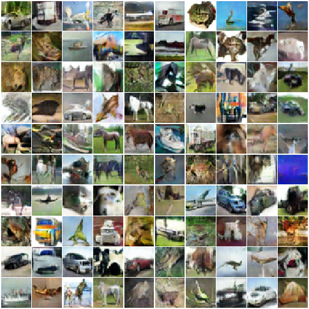

### Discussion

Consider toy problem:
- powerfull discriminator;
- (almost) disjoint supports:
  - unlucky initial guess;
  - target data is on low-dimensional manifold;

***

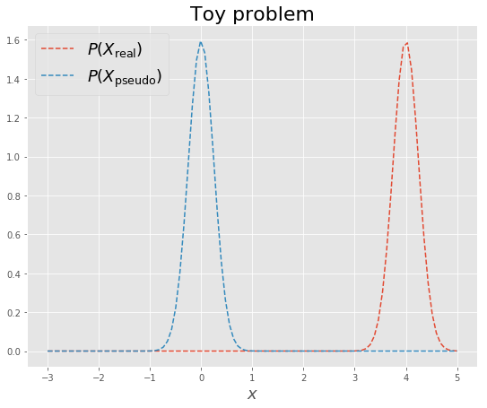

### Discussion

After training discriminator:

~~~eqnarray*
  \frac{\partial \mathcal{L}(\theta, \psi)}{\partial \psi} &=& - \frac{1}{1 - f(g(z))} \cdot \frac{\partial f}{\partial g} \cdot \frac{\partial g}{\partial \psi};\\
  f(g(z)) &\approx& 0;\\
  \frac{f}{\partial g} &\approx& 0.
~~~

$\Rightarrow$ gradients tend to vanish on early stages.

### Discussion

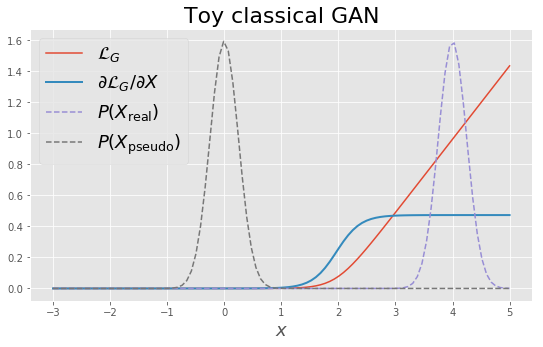

## GAN training tricks

### Fight for the gradients

Start with heavily restricted discriminator:
- don't train discriminator fully:
  - poor-man solution;
- add noise to the samples:
  - especially nicely works for target on low-dimensional manifolds;
  - easy to control.
- heavy regularization.

As learning progresses gradually relax restrictions.

### Fight for the gradients

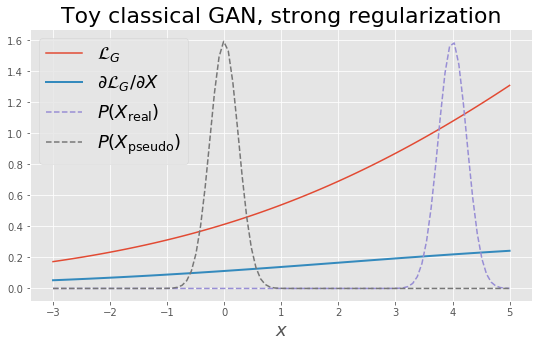

### Fight for the gradients

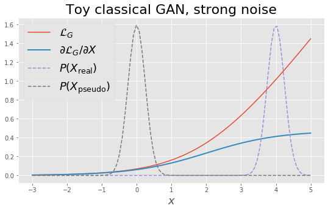

### Fight for the gradients

Discriminator stop criteria:

```python
  for epoch in ...:
    while loss > C1:
      loss = train_discriminator()

    while loss < C2:
      loss = train_generator()
```

### Ensemble of discriminators

- if discriminator $f_1 \in \mathcal{F}_1$ covers all possible $f_2 \in \mathcal{F}_2$, i.e. $\mathcal{F}_2 \subset \mathcal{F}_1 \subseteq \mathcal{F}$, then:
  $$\log 2\,-\,\mathrm{JS}(X, g(Z)) = \min_{f \in \mathcal{F}} \mathcal{L}(f, g) \leq \min_{f \in \mathcal{F}_1} \mathcal{L}(f, g) \leq \min_{f \in \mathcal{F}_2} \mathcal{L}(f, g)$$
- simple discriminator tend to provide gradients for a larger set of $g$, but don't lead to exact solution;
- powerful discriminator provide precise solution, but suffer from vanishing gradients.

Ensemble of discriminators with capacities from low to sufficient:
- provide gradient on early stages;
- lead to the precise solution.

### Ensemble of discriminators

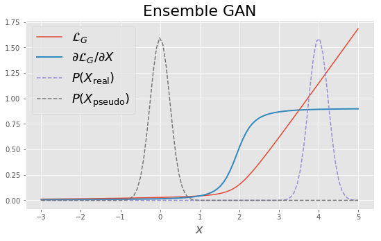

### Bonus

Using ensemble of discriminators progress of training can be estimated by sum of individual losses:
$$\mathcal{L} = \sum_i \mathcal{L}^i$$

---
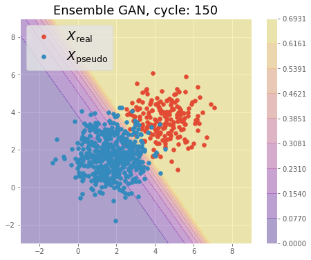

***
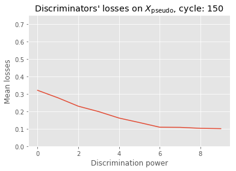

### Mode collapse

Often generator learns to output constant:
- syndrome of poorly trained discriminator;
- might occur while using early stopping of discriminator training:
  - that is why it is a poor solution.
- ensure, discriminator is trained sufficiently long;
- prevent gradient vanishing by another methods.

### Feature matching

Let $h$ be some **feature**, then feature matching is an auxiliary objective:

$$\mathcal{L}_{\mathrm{fm}} = \| \E_{x \sim \mathrm{data}} h(x) - \E_{z \sim Z} h(g(z)) \|^2$$

### Mini-batch discrimination

Instead of predicting label for a single sample, predict a single label for the whole mini-batch:
- prevents mode collapse by producing equivalent gradients to a multiple points.

***

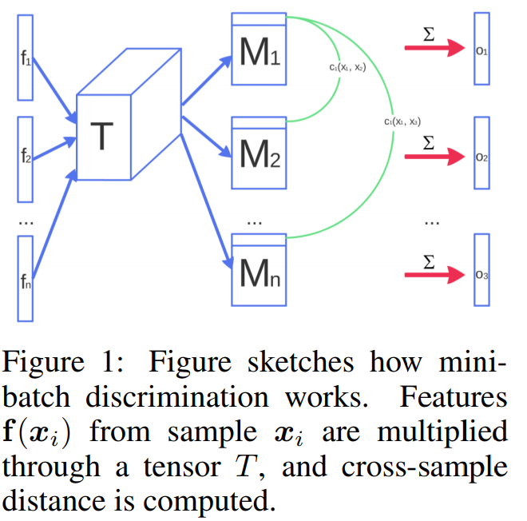

## EBGAN and WGAN

### Fight for the gradients

A lot of problems with training GANs can be traced to problem of maintaining balance between:
- vanishing gradients;
- sufficiently trained discriminator.

`\vspace{5mm}`

Fully trained discriminator $\Rightarrow$ vanishing gradients.`\\[5mm]`

Poorly trained discriminator $\Rightarrow$ mode collapse.`\\[5mm]`

**These properties are fundamental for Jensen-Shannon metric.**

### Energy-Based GAN

Energy-Based GAN utilizes different loss function:

$$\mathcal{L} = \E_{x \sim \mathrm{data}} E(x) + \E_{z \sim Z} \left[ m - E(g(z)) \right]_+$$

~~~eqnarray*
\mathcal{L}_{f} &=& \E_{x \sim \mathrm{data}} E(x) + \E_{z \sim Z} \left[ m - E(g(z)) \right]_+ \to \min;\\
\mathcal{L}_{g} &=& \E_{z \sim Z} E(g(z)) \to \min;\\
~~~

where:
- $E(x) > 0$ - an energy function;
- $m$ - margin, a hyperparameter;
- $[a]_+ = \max(0, a)$.

### Energy-Based GAN

- corresponds to minimization of Total-Variation distance:
  $$\mathrm{TV}(P, Q) = \sum_x |P(x) - Q(x)|$$

- the most popular choice of energy function is MSE of an AutoEncoder:
  $$E(x) = \| x - \mathrm{AE}(x) \|^2$$

- discriminator tend to have gradients almost everywhere;
- discriminator should be trained until convergence, i.e. as long as possible.

### Wasserstein GAN

Wasserstein or Earth-Mover distance:
  $$W(P, Q) = \inf_{\Gamma \in \Pi(P, Q)} \E_{(x, y) \sim \Gamma} \|x - y\|$$

where:
- $\Pi(P, Q)$ - set of all possible joint distributions $\Gamma$ with marginals $P$ and $Q$.

`\vspace{5mm}`

~~~equation*
    W(P, Q) = \sup_{\|f\|_L \leq 1} \E_{x \sim \mathrm{data}} f(x) - \E_{z \sim Z} f(g(z))
~~~

where:
- $\|f\|_L = \sup \|\nabla f\|$ - Lipschitz constant for $f$.

### Wasserstein GAN

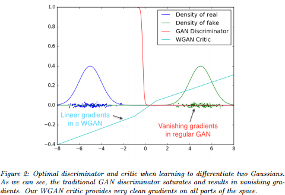

### Wasserstein GAN training

`\vspace{5mm}`

~~~algorithm [H]
  \caption{Wasserstein GAN trainin}
  \begin{algorithmic}
  \State
  \While{not enough}
    \For{$i := 1, \dots, n$}
      \State sample real data $\{ x_j \}^{k}_{j = 1}$
      \State sample latent variables $\{ z_j \}^{l}_{j = 1}$
      \State $g_\theta \gets \nabla_\theta \left[ \frac{1}{k}\sum_j f_\theta(x_j) - \frac{1}{l} \sum_j f_\theta(g_\psi(z_j)) \right]$
      \State $\theta \gets \theta + \alpha \mathrm{RMSProp}(\theta, g_\theta)$
      \State $\theta \gets \mathrm{clip}(\theta, -1, 1)$
    \EndFor
    \State sample latent variables $\{ z_j \}^{l}_{j = 1}$
    \State $g_\psi = - \nabla_\psi \left[ \frac{1}{l} \sum_j f_\theta(g_\psi(z_j)) \right]$
    \State $\psi \gets \psi - \alpha \mathrm{RMSProp}(\psi, g_\psi)$
  \EndWhile
  \end{algorithmic}
~~~

## Beyond generative

### Conditional GAN

Allows to train a conditional generator $g(z, y)$:
- both discriminator and generator receive condition.

***

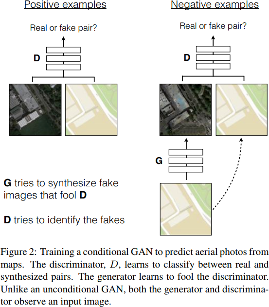

### GAN as auxiliary loss

For image to image translation, loss:

$$\mathcal{L} = \frac{1}{n} |f(x) - y| + \lambda \mathcal{L}_{\mathrm{GAN}}$$

where:
- $\mathcal{L}_{\mathrm{GAN}}$ - GAN loss on small image patches;

produces highly realistic images.

### GAN as auxiliary loss

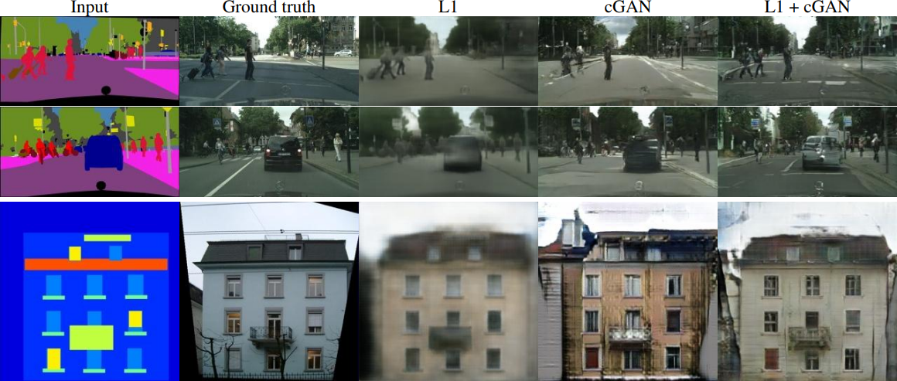

## Summary

### Summary

Generative Adversarial Networks:
- utilize adversary to measure statistical distance:
  - classical GAN estimates Jensen-Shannon distance;
  - EB-GAN estimates total-variation distance;
  - W-GAN estimates Wasserstein distance.
- can be modified to learn conditional distributions;
- can be used as auxiliary loss.

### References I

- Goodfellow I, Pouget-Abadie J, Mirza M, Xu B, Warde-Farley D, Ozair S, Courville A, Bengio Y. Generative adversarial nets. InAdvances in neural information processing systems 2014 (pp. 2672-2680).
- Arjovsky M, Bottou L. Towards principled methods for training generative adversarial networks. arXiv preprint arXiv:1701.04862. 2017 Jan 17.
- Salimans T, Goodfellow I, Zaremba W, Cheung V, Radford A, Chen X. Improved techniques for training gans. InAdvances in Neural Information Processing Systems 2016 (pp. 2234-2242).

### References II

- Zhao J, Mathieu M, LeCun Y. Energy-based generative adversarial network. arXiv preprint arXiv:1609.03126. 2016 Sep 11.
- Arjovsky M, Chintala S, Bottou L. Wasserstein gan. arXiv preprint arXiv:1701.07875. 2017 Jan 26.
- Gulrajani I, Ahmed F, Arjovsky M, Dumoulin V, Courville A. Improved training of wasserstein gans. arXiv preprint arXiv:1704.00028. 2017 Mar 31.

### References III

- Mirza M, Osindero S. Conditional generative adversarial nets. arXiv preprint arXiv:1411.1784. 2014 Nov 6.
- Radford A, Metz L, Chintala S. Unsupervised representation learning with deep convolutional generative adversarial networks. arXiv preprint arXiv:1511.06434. 2015 Nov 19.
- Isola P, Zhu JY, Zhou T, Efros AA. Image-to-image translation with conditional adversarial networks. arXiv preprint arXiv:1611.07004. 2016 Nov 21.
