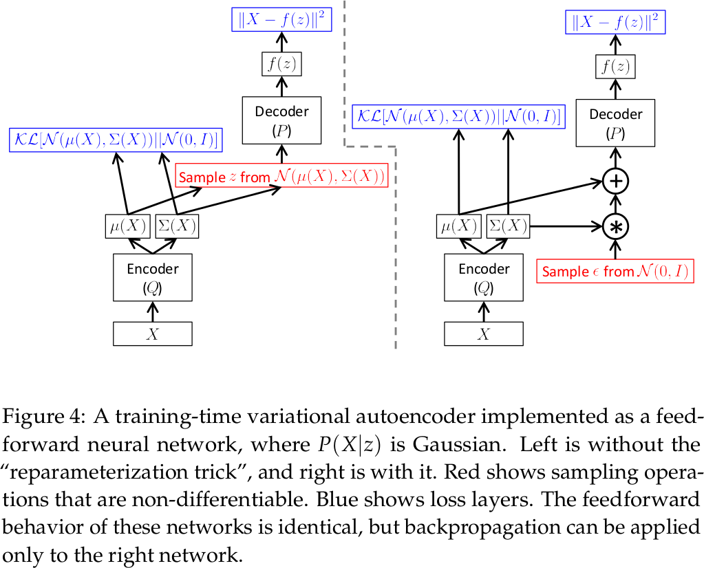
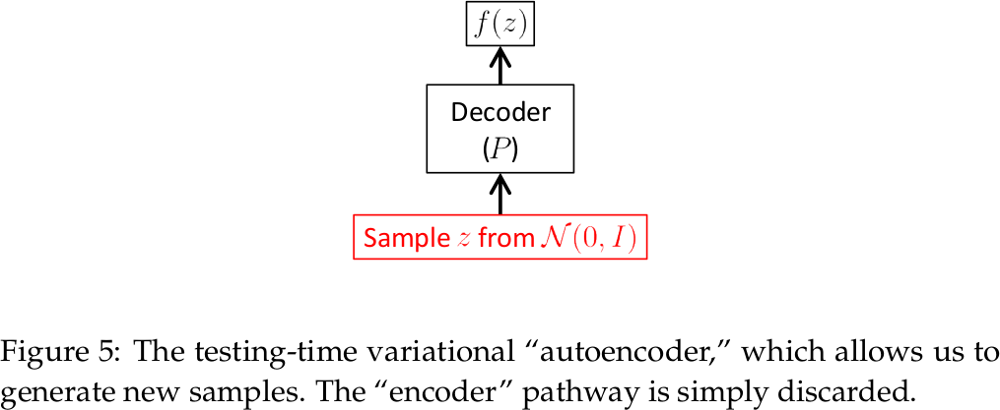
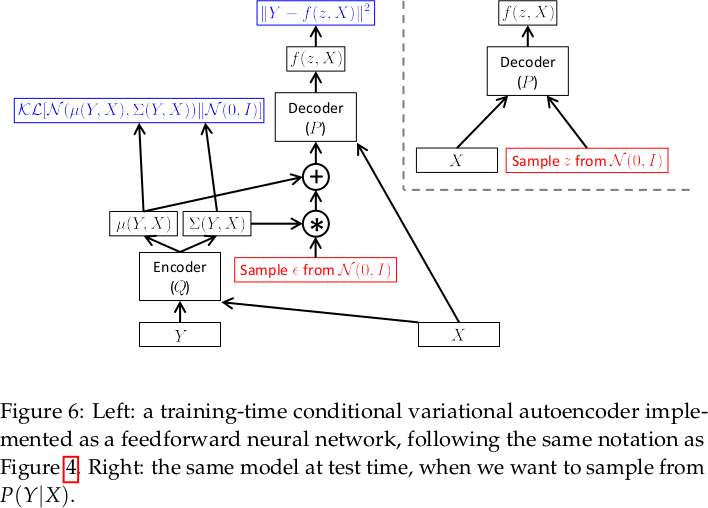
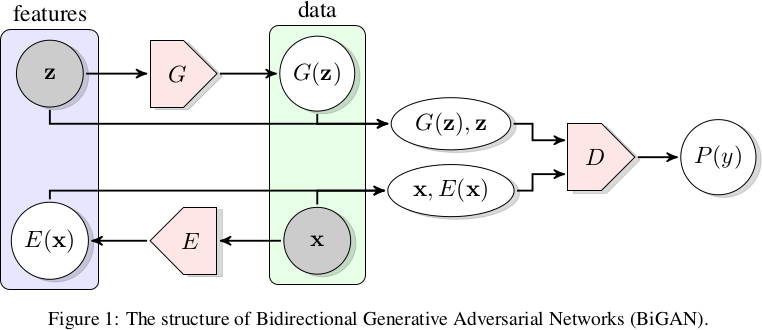
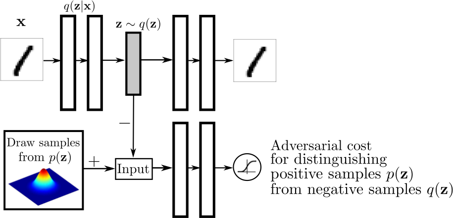
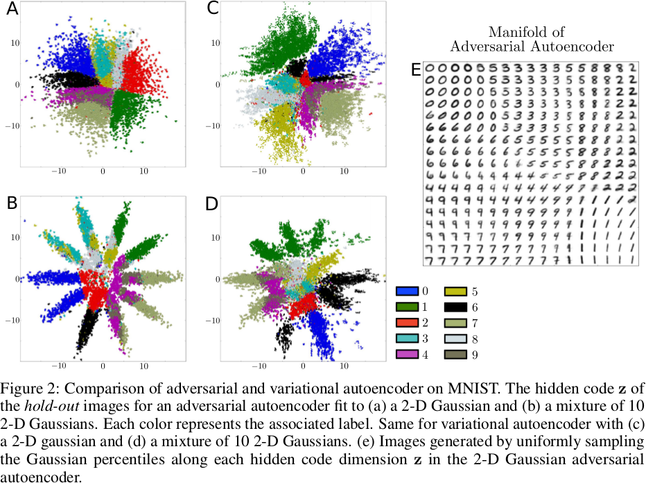
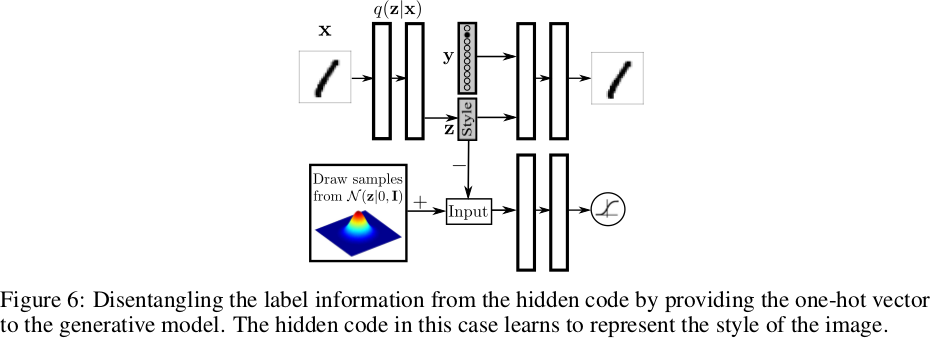
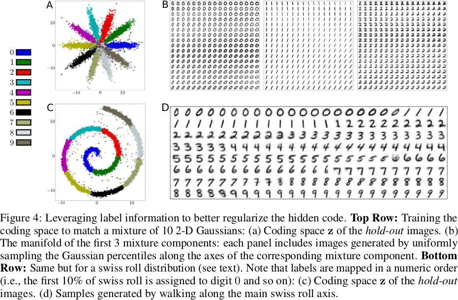
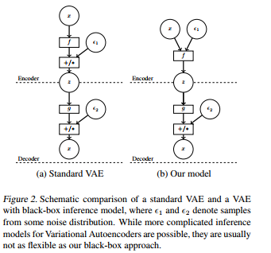

# Variational Auto-Encoder and generative Zoo

~~~
\subtitle{Machine Learning and Data Mining}
\author{Maxim Borisyak}

\institute{National Research University Higher School of Economics (HSE)}
\usepackage{amsmath}

\DeclareMathOperator*{\E}{\mathbb{E}}

\DeclareMathOperator*{\var}{\mathbb{D}}
\newcommand\D[1]{\var\left[ #1 \right]}

\DeclareMathOperator*{\argmin}{\mathrm{arg\,min}}
\DeclareMathOperator*{\argmax}{\mathrm{arg\,max}}

\newcommand\dmid{\,\|\,}
~~~

## Generative models

### Generative models

- Informally, given samples we wish to learn generative procedure.
- Formally, given samples of a random variable $X$, we wish to find $X'$, so that:
$$P(X) \approx P(X')$$

### In the previous episodes

RBM:
- Maximum Likelihood fit through energy function;
- Gibbs sampling;

GAN:
- transformation from a tractable random variable to a target $X = f(Z)$;
- minimizes Jensen-Shannon distance which estimated via classifier;
- direct sampling.

## Variational Auto-Encoder

### Latent variables revisited

Before generating a sample, model should first decide what it should generate:
- which digit to generate: 0, 1, `\dots`, 9
- width of stokes;
- 'speed';
- etc.

Such decision can be represented as random variables, often called **latent variables**.

### Latent variables revisited

Like most of the generative models, VAE searches random variable as a function of *latent variables* $Z$:
- easy to sample;
- tractable distribution.

Most common choice $Z \sim \mathcal{N}^n(0, 1)$.

Unlike GAN, transformation $Z \to X$ is **not deterministic**:

~~~eqnarray*
  P(X) &=& \int P(X \mid z) P(z) dz;\\
  P(X | z) &=& \mathcal{N}(X \mid f(z), \sigma^2 I).
~~~

### Latent variables revisited

~~~equation*
P(X) = \int P(X \mid z) P(z) dz = \E_z P(X \mid z)
~~~

- sampling from $P(X)$ might be computationally expensive;
- most of $z$ produce $P(X \mid z) \approx 0$.

### Variational bound

$$P(X) = \int P(X \mid z) P(z) dz = \E_Z P(X \mid Z)$$

In order to make sampling tractable, P(Z) can be replaced by some $Q(Z \mid X)$.

~~~equation*
\log P(X) = \mathrm{KL}\left(Q(Z \mid X) \dmid P(Z \mid X) \right) + \mathcal{L}(X) \geq \mathcal{L}(X)
~~~

~~~multline*
  \mathcal{L}(X) = \E_{Z \sim Q}\left[ -\log Q(Z \mid X ) + \log P(X, Z) \right] =\\
    - \mathrm{KL}\left( Q(Z \mid X) \dmid P(Z) \right) + \E_{z \sim Q(Z \mid X)}\left[ \log P(X \mid Z) \right]
~~~

### VAE objective

~~~multline*
\log P(X) - \mathrm{KL}\left(Q(Z \mid X) \dmid P(Z \mid X) \right) = \\
  \E_{z \sim Q(Z \mid X)} \log P(X \mid Z) - \mathrm{KL}\left( Q(Z \mid X) \dmid P(Z) \right)
~~~

where:
- $\mathrm{KL}\left(Q(Z \mid X) \dmid P(Z \mid X) \right)$ - error term:
  - recognition model penalty;
- $\E_{z \sim Q(Z \mid X)}\left[ \log P(X \mid Z) \right]$ - reconstruction error:
  - can be estimated like in an ordinary AE;
- $\mathrm{KL}\left( Q(Z \mid X) \dmid P(Z) \right)$ - something similar to regularization;
  - can be computed analytically if $P(Z)$ is well defined.

### Reconstruction error

$$\mathrm{RE} = \E_{z \sim Q(Z \mid X)}\left[ \log P(X \mid Z) \right]$$

- for Gaussian posterior i.e. $P(X \mid Z) = \mathcal{N}(X \mid f(z), \sigma^2 I)$:
  $$\mathrm{RE} = \frac{1}{2}E_{Z \sim Q(Z \mid X)} \left[ f(Z) - X \right]^2 + \mathrm{const}$$

- for Benulli posterior ( e.g. for discrete output)  $P(X = 1 \mid Z) = f(z)$:
  $$\mathrm{RE} = E_{Z \sim Q(Z \mid X)} \left[ X \log f(Z) + (1 - X) \log (1 - f(Z)) \right]$$

### The other term

$$\mathrm{KL}\left( Q(Z \mid X) \dmid P(Z) \right)$$

Consider:
- $Q(Z \mid X) = \mathcal{N}(Z \mid \mu(X), \Sigma(X))$;
- $P(Z) = \mathcal{N}(0, I)$

~~~multline*
\mathrm{KL}\left( \mathcal{N}(X \mid f(Z), \Sigma(Z)) \dmid \mathcal{N}(X \mid f(Z), \Sigma(Z)) \right) =\\
  \frac{1}{2}\left( \mathrm{tr}(\Sigma(X)) + \|\mu(X)\|^2 - k - \log \det \Sigma(X) \right) = \\
  \frac{1}{2} \left( \|\mu(X)\|^2 + \sum_i \Sigma_{ii}(X) - \log \Sigma_{ii}(X) \right) - \frac{k}{2}
~~~

### Training time

### Testing time

### Conditional VAE

### Discussion

VAE:
- simple to implement;
- stable training;
- fast training;
- form of inference and generative network impose serious restrictions on possible models;
- might be tricky to modify.

***

GAN:
- might be tricky to implement;
- training requires tricks (or EB/W-GAN);
- training is slow;
- often, produces state-of-the-art models;
- flexible architecture.

## BiGAN

### BiGAN

The main difference between GAN and VAE is absence of an inference model in GAN ($Q(Z | X)$ in VAE).

BiGAN adds this inference by introducing an inference networks:

~~~eqnarray*
  X' = G(Z);\\
  Z' = E(X);\\
~~~

and solving min-max problem for:

~~~multline*
  \mathcal{L}(D, E, G) = \E_{x} \log D(x, E(x)) + \E_z \log (1 - D(G(z), z))
~~~

### BiGAN

### BiGAN

- BiGAN can be used as dimensionality reduction technique;
- unlike AE, importance of a feature produced not by Euclidean distance,
but by a discriminator.

## Adversarial AutoEncoder

### Adversarial AutoEncoder

- replaces VAE regularization tern with GAN objective;
- also makes both inference and generative networks deterministic:
  - removes possible error source;
- essentially, AutoEncoder with regularization term that drives code space to a predefined distribution.

### Adversarial AutoEncoder

### Adversarial AutoEncoder

### Adversarial AutoEncoder

Codes can be associated with known high level features, e.g. face expression.

### Adversarial AutoEncoder

## Adversarial Variational Bayes

### Adversarial Variational Bayes

Adversarial Variational Bayes replaces inference model $Q(Z \mid X)$ by a black box:

### Adversarial Variational Bayes

~~~multline*
  \mathcal{L}(\theta, \phi) = \\ \E_x\left[ -\mathrm{KL}(q_\phi(z \mid x) \dmid p(z)) + \E_{q_\phi(z \mid x)} \log p_\theta(x \mid z) \right] =\\
    \E_x \E_{q_\phi(z \mid x)} \left[ \log p(z) - \log q_\phi(z \mid x) + \log p_\theta(x \mid z) \right]
~~~

Solution for the optimization problem:

~~~multline*
\max_T \E_x \E_{q_\phi(z \mid x)} \log \sigma(T(x, z)) + \E_x \E_{p(z)} \log (1 - \sigma(T(x, z)))
~~~~

~~~equation*
T^*(x, z) = \log q_\phi(z \mid x) - \log p(z)
~~~

`\vspace{3mm}`

~~~equation*
\boxed{
  \mathcal{L}(\theta, \phi) = \E_x\left[ -T^*(x, z) + \log p_\theta(x \mid z) \right]
}
~~~

### Adversarial Variational Bayes

~~~multline*
\text{AVB} = \text{VAE objective} + \\ \text{black box inference} + \\ \text{adversarial estimation of KL};
~~~

## Summary

### Summary

Varitional AutoEncoder:
- AutoEncoder that drives code space to match predefined distribution;
- often inferior to GAN;
- stable and relatively fast training;
- various adversarial modifications.

### References I

- Doersch, C., 2016. Tutorial on variational autoencoders. arXiv preprint arXiv:1606.05908.
- Kingma, D.P. and Welling, M., 2013. Auto-encoding variational bayes. arXiv preprint arXiv:1312.6114.
- Dumoulin, V., Belghazi, I., Poole, B., Lamb, A., Arjovsky, M., Mastropietro, O. and Courville, A., 2016. Adversarially learned inference. arXiv preprint arXiv:1606.00704.

### References II

- Donahue, J., Krähenbühl, P. and Darrell, T., 2016. Adversarial feature learning. arXiv preprint arXiv:1605.09782.
- Makhzani, A., Shlens, J., Jaitly, N., Goodfellow, I. and Frey, B., 2015. Adversarial autoencoders. arXiv preprint arXiv:1511.05644.
- Mescheder, L., Nowozin, S. and Geiger, A., 2017. Adversarial variational bayes: Unifying variational autoencoders and generative adversarial networks. arXiv preprint arXiv:1701.04722.
