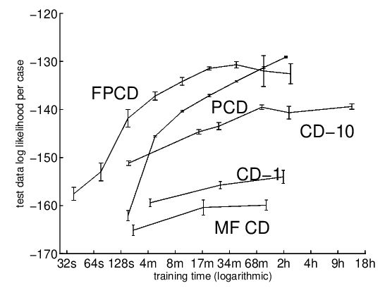
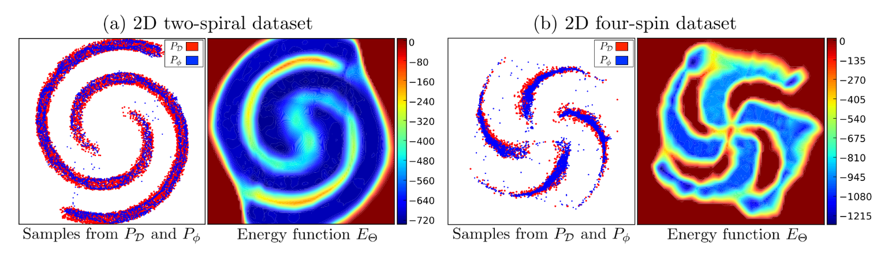
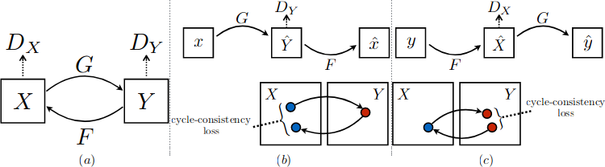

# Generative models, selected topics

~~~
\subtitle{Machine Learning and Data Mining}
\author{Maxim Borisyak}

\institute{National Research University Higher School of Economics (HSE)}
\usepackage{amsmath}

\DeclareMathOperator*{\E}{\mathbb{E}}

\DeclareMathOperator*{\var}{\mathbb{D}}
\newcommand\D[1]{\var\left[ #1 \right]}

\DeclareMathOperator*{\argmin}{\mathrm{arg\,min}}
\DeclareMathOperator*{\argmax}{\mathrm{arg\,max}}

\newcommand\dmid{\,\|\,}
~~~

## RBM

### Contrastive Divergence

Contrastive Divergence (CD-k) update:
- repeat:
  - sample $X^+$ from known points;
  - k-steps of Gibbs sampling initializing chain with $X^+$.
  - $\theta := \theta + \alpha \left[ \nabla_\theta \mathrm{E}(X^-) - \nabla_\theta \mathrm{E}(X^+) \right]$

Properties:
- small k lead to correlated $X^-$ and $X^+$, which negatively impacts quality;
  - nevetheless, CD-1 provides decent results;
- large k are expensive.

### Persistent CD

Persistent Contrastive Divergence:
- initialize negative chain $X^-$ (*virtual particles*) with known points;
- repeat:
  - sample $X^+$ from known points;
  - continue sampling from negative chain without resetting;
  - $\theta := \theta + \alpha \left[ \nabla_\theta \mathrm{E}(X^-) - \nabla_\theta \mathrm{E}(X^+) \right]$

Properties:
- small k leads to correlated negative samples instead;
- better suited for small learning rates;
- seems to be superior to CD-k even for large k.

### Persistent CD

### Persistent CD

### Persistent CD

Gibbs sampling corresponds to a slightly different distribution $R$ than the one define by energy function $Q_\theta$.`\\`

The actual loss:
$$C = \mathrm{KL}(P \mid Q_\theta) - \mathrm{KL}(R \mid Q_\theta) \to \min$$

- $\mathrm{KL}(R \mid Q_\theta)$ large: negative chain mixes fast ($R$ gets closer to $Q_\theta$);
- $\mathrm{KL}(R \mid Q_\theta)$ small: updates closely follow $\nabla \mathcal{L}$, but mixing slows.

### Fast weights PCD

- FPCD introduces two sets of weights:
  - $\theta$ - regular parameters;
  - $\theta_f$ - fast parameters for MCMC.
- fast parameters are used for negative sampling;
- fast parameters have higher learning rate $\beta > \alpha$ and strong decay $\rho$.
- virtual particles follow smoothed energy function, thus even faster mixing.

### Fast weights PCD

- initialize virtual particles;
- repeat:
  - sample from known points, sample hidden units from $Q_\theta$;
  - samples virtual particles from Gibbs chain over $Q_{\theta + \theta_f}$;
  - compute CD-update and gradient $g$.
  - $\theta := \theta + \alpha g$;
  - $\theta_f := \rho \theta_f + \beta g$.

### Fast Persistent CD

### Fast Persistent CD

## From RBM to Deep Energy Models

### Energy Models

~~~multline*
  \frac{\partial}{\partial \theta} \log P(x) = \\
    \frac{\partial}{\partial \theta} \log \left[ \frac{1}{Z} \exp(-\mathrm{E}(x)) \right] =\\
      - \frac{\partial}{\partial \theta} \log {Z} - \frac{\partial}{\partial \theta} \mathrm{E}(x) = \\
      - \frac{1}{Z} \frac{\partial}{\partial \theta} Z  - \frac{\partial}{\partial \theta}\mathrm{E}(x) = \\
        \E_{\chi \sim P_\theta}\frac{\partial}{\partial \theta} \mathrm{E}(\chi) - \frac{\partial}{\partial \theta} \mathrm{E}(x)
~~~

### Energy Models

$$ \frac{\partial}{\partial \theta} \log P(x) = \E_{\chi \sim P_\theta}\frac{\partial}{\partial \theta} \mathrm{E}(\chi) - \frac{\partial}{\partial \theta} \mathrm{E}(x)$$

- nothing stops us from using an arbitrary energy function, e.g. defined by a deep network;
- except for $\chi \sim P_\theta$.

### Deep Energy Models

Instead of using $\chi \sim P_\theta$:
- introduce generator $G$;
- sample $\chi = G_\phi(z)$, $z \sim P_z = \mathcal{N}^k(0, 1)$;
- make generator $G_\phi$ to be close to $P_\theta$:

~~~equation*
  \mathrm{KL}(P_\phi \mid P_\theta) = -\E_{z \sim P_z} \log P_\theta(G_\phi(z)) - H\left[ P_\phi \right]
~~~

where $H(P)$ --- entropy of $P$.

### Deep Energy Models

~~~equation*
  \mathrm{KL}(P_\phi \mid P_\theta) = -\E_{z \sim P_z} \log P_\theta(G_\phi(z)) - H\left[ P_\phi \right]
~~~

~~~eqnarray*
  \nabla_\phi \mathrm{KL}(P_\phi \mid P_\theta) &=& -\E_{z \sim P_z} \nabla_\phi \log P_\theta(G_\phi(z)) - \nabla_\phi H\left[ P_\phi \right];\\
  -\E_{z \sim P_z} \nabla_\phi \log P_\theta(G_\phi(z)) &=& \E_{z \sim P_z} \nabla_\phi E_\theta(G_\phi(z));\\
  \nabla_\phi H\left[ P_\phi \right] &=& ???
~~~

### Deep Energy Models

$$\nabla_\phi H\left[ P_\phi \right] = ???$$

- entropy is to be maximized;
- entropy term prevents generator from collapsing into a single point $\argmin_x E_\theta(x)$;
- instead of computing entropy directly, authors suggest:
  - replace $H\left[ P_\phi \right]$ by entropy of activation;
  - use batch normalization;
  - assume all activation are independent and normally distributed.

$$H\left[ P_\phi \right] \to H\left[ \mathcal{N}(\mu_i, \sigma_i) \right] = \frac{1}{2}\sum_i \log (2 e \pi \sigma^2_i)$$
where $\mu_i$ and $\sigma_i$ are mean and variance of activation of $i$-th hidden unit.

### Deep Energy Models

### Deep Energy Models

### Deep Energy Models

## Generative Moment Matching Network

### Maximum Mean Discrepancy

~~~multline*
  \mathcal{L}_{MMD}(X, Y) = \left\| \frac{1}{N}\sum_i \varphi(x_i) - \frac{1}{M} \sum_i \varphi(y_i)  \right\|^2 = \\
    \frac{1}{N^2}\sum_{i, j} \varphi(x_i)^T\varphi(x_j) + \frac{2}{N M}\sum_{i, j} \varphi(x_i)^T\varphi(y_j) +
    \frac{1}{M^2}\sum_{i, j} \varphi(y_i)^T\varphi(y_j) = \\
    \frac{1}{N^2}\sum_i \sum_j k(x_i, x_j) + \frac{2}{N M}\sum_i \sum_j k(x_i, y_j) +
    \frac{1}{M^2}\sum_i \sum_j k(y_i, y_j).
~~~
where:
- $\phi(x)$ - feature map;
- $k(x, y) = \varphi(x)^T \varphi(y)^T$, e.g. $k(x, y) = \exp(-\frac{1}{2\sigma}\|x - y\|^2)$.

### Generative Moment Matching Network

### Generative Moment Matching Network

## Denoising Auto-Encoder

### Denoising Auto-Encoder

If:
- $X$ - sample of real data;
- $\varepsilon \sim \mathcal{N}(0, \sigma^2)$;
- $X' = X + \varepsilon$;
- $g(x) = x + \alpha \nabla \log P_X(x)$

then:

$$g \approx \argmin_f \E_{X, \varepsilon} \| X - f(X') \|^2$$

### Denoising Auto-Encoder

- $C(X' \mid X)$ - corruption, e.g. adding Gaussian noise;
- $P_\theta(X \mid X')$ - reconstruction, e.g. by an Auto-Encoder.

If:
$$P_\theta(X \mid X') \sim P(X \mid X')$$
then Markov chain:

~~~eqnarray*
  X_t &=& P_\theta( X \mid X'_{t - 1} );\\
  X'_t &=& C(X' \mid X_t)
~~~
converges to $P(x)$.

### Denoising Auto-Encoder

Simple training:
- sample $X$ from real data;
- apply corruption $X' \sim C(X' \mid X)$;
- $\theta := \theta + \beta \nabla_\theta \log P_\theta(X \mid X')$;
- repeat.

### Denoising Auto-Encoder

Walkback algorithm:

- sample $X$ from real data;
- $X^* := X$, $\mathrm{batch} = []$
- until coin says so:
  - apply corruption $X' \sim C(X' \mid X^*)$;
  - extend $\mathrm{batch}$ with $X'$;
  - reconstruct $X^* := P_\theta(X \mid X')$
- $\theta := \theta + \beta \nabla_\theta \frac{1}{n} \sum_i \log P_\theta(X \mid X'_i)$;

### Denoising Auto-Encoder

Simple training:

### Denoising Auto-Encoder

Walkback training:

## Image-to-Image

### Cycle-GAN

Cycle-GAN considers **unpaired** image-to-image translation.

***

### Cycle-GAN

### Cycle Loss

Adversarial loss:

$$\mathcal{L}_{\mathrm{GAN}}(G, D, X, Y) = \E_{x \sim X} \log (1 - D(G(x))) + \E_{y \sim Y} \log D(y)$$

Self-consistency loss:
$$\mathcal{L}_{\mathrm{cycle}}(G, F, X) = \E_{x \sim X} \| F(G(x) - x \|_1$$

Full loss:

~~~multline*
\mathcal{L} = \mathcal{L}_{\mathrm{GAN}}(G, D_Y, X, Y) + \mathcal{L}_{\mathrm{GAN}}(F, D_X, Y, X) + \\ \mathcal{L}_{\mathrm{cycle}}(G, F, X) + \mathcal{L}_{\mathrm{cycle}}(F, G, Y)
~~~

### Examples

### Examples

## UNIT

### UNIT

~~~eqnarray*
  \mathcal{L} &=& \mathcal{L}_{\mathrm{VAE}}(E_1, G_1) + \mathcal{L}_{\mathrm{GAN}}(E_1, G_1, D_1) + \mathcal{L}_{\mathrm{CC}}(E_1, G_1, E_2, G_2)\\
              &+& \mathcal{L}_{\mathrm{VAE}}(E_2, G_2) + \mathcal{L}_{\mathrm{GAN}}(E_2, G_2, D_2) + \mathcal{L}_{\mathrm{CC}}(E_2, G_2, E_1, G_1)
~~~

### UNIT

## References

### References

- Tieleman T. Training restricted Boltzmann machines using approximations to the likelihood gradient. InProceedings of the 25th international conference on Machine learning 2008 Jul 5 (pp. 1064-1071). ACM.
- Tieleman T, Hinton G. Using fast weights to improve persistent contrastive divergence. InProceedings of the 26th Annual International Conference on Machine Learning 2009 Jun 14 (pp. 1033-1040). ACM.
- Bengio Y, Yao L, Alain G, Vincent P. Generalized denoising auto-encoders as generative models. InAdvances in Neural Information Processing Systems 2013 (pp. 899-907).

### References

- Kim T, Bengio Y. Deep directed generative models with energy-based probability estimation. arXiv preprint arXiv:1606.03439. 2016 Jun 10.
- Zhu JY, Park T, Isola P, Efros AA. Unpaired image-to-image translation using cycle-consistent adversarial networks. arXiv preprint. 2017 Oct 1.
- Li Y, Swersky K, Zemel R. Generative moment matching networks. InInternational Conference on Machine Learning 2015 Jun 1 (pp. 1718-1727).

### References

- Larsen AB, Sønderby SK, Larochelle H, Winther O. Autoencoding beyond pixels using a learned similarity metric. arXiv preprint arXiv:1512.09300. 2015 Dec 31.
- Liu MY, Breuel T, Kautz J. Unsupervised image-to-image translation networks. InAdvances in Neural Information Processing Systems 2017 (pp. 700-708).
