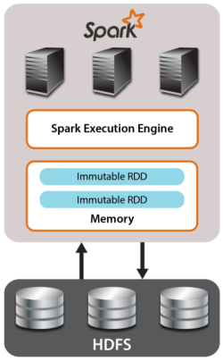
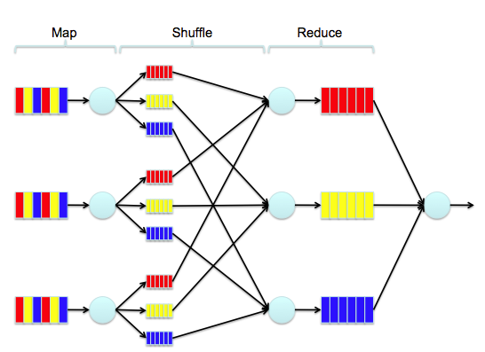

# Distributed Computations for ML

~~~
\subtitle{Machine Learning and Data Mining}
\author{Maxim Borisyak}

\institute{National Research University Higher School of Economics (HSE)}
\usepackage{amsmath}

\usepackage{algorithm}
\usepackage{algpseudocode}

\DeclareMathOperator*{\E}{\mathbb{E}}

\DeclareMathOperator*{\var}{\mathbb{D}}
\newcommand\D[1]{\var\left[ #1 \right]}

\newcommand\dmid{\,\|\,}

\DeclareMathOperator*{\argmin}{\mathrm{arg\,min}}
\DeclareMathOperator*{\argmax}{\mathrm{arg\,max}}
~~~

## Big Data

### Big Data

Some industrial problems have too much data:
- it can not be stored on a one machine:
  - usually, meaning RAM;
- or, it can not be processed on one machine in an adequate amount of time:
  - video/music recommendations should be updates frequently.

### Big Data

Problems:
- how to store 'big' data;
- how to distribute data across computational cluster;
- how to compute whatever you need.

### Storage

> Usually it is a distributed database...

Examples:
- Any proper SQL DB (e.g. PostgreSQL);
- Cassandra;
- Hadoop Distributed File System (also HBase).

### How to distribute data

Timescale of typical computer operations:

`\vspace*{3mm}`

~~~tabular {| l | r |}
\hline
execute typical instruction	& 1 nanosec \\
\hline
fetch from L1 cache memory &	0.5 nanosec \\
\hline
branch misprediction	& 5 nanosec \\
\hline
fetch from L2 cache memory & 7 nanosec \\
\hline
Mutex lock/unlock	& 25 nanosec \\
\hline
fetch from main memory & 100 nanosec \\
\hline
send 2K bytes over 1Gbps network & 20,000 nanosec \\
\hline
read 1MB sequentially from memory & 250,000 nanosec \\
\hline
fetch from new disk location (seek) & 8,000,000 nanosec \\
\hline
read 1MB sequentially from disk	& 20,000,000 nanosec \\
\hline
send packet US to Europe and back	& 150,000,000 nanosec \\
\hline
~~~

### How to distribute data

Humanized version (nanosec $\rightarrow$ sec):

`\vspace*{3mm}`

~~~tabular {| l | r |}
\hline
execute typical instruction	& 1 sec \\
\hline
fetch from L1 cache memory &	0.5 sec \\
\hline
branch misprediction	& 5 sec \\
\hline
fetch from L2 cache memory & 7 sec \\
\hline
Mutex lock/unlock	& 25 sec \\
\hline
fetch from main memory & 2 min \\
\hline
send 2K bytes over 1Gbps network & 6 hours \\
\hline
read 1MB sequentially from memory & 3 days \\
\hline
fetch from new disk location (seek) & 3 month \\
\hline
read 1MB sequentially from disk	& 1 year \\
\hline
send packet US to Europe and back	& 5 years \\
\hline
~~~

### How to distribute data

Answer:
- keep everything in RAM;
- send as little as possible data over network.

### Question

Quite a typical operation is aggregation by key:
- a number of pairs _(K, V)_ distributed across multiple machines;
- there can be multiple instances with the same key;
- the problem is to aggregate all values corresponding to one key, i.e. for some $f$ produce:`\\`
_(K, f(V1, V2, V3, ...))_ for each key _K_.

How would you implement:
- counting words across a large text collection;
- computing personal recommendations for a large amount of users given their logs?

## Distributed computations

### How?

> How can we implement framework for distributed computations?

### A simple approach

- we known how to write sequential code;
- we known how to transmit data;
- just make a communication toolkit.

Example: MPI

```c
my_result = /** computing something **/
MPI_Reduce(
  &my_result,
  &result,1,
  MPI_REAL,
  MPI_SUM,0,
  MPI_COMM_WORLD
);
```

### Discussion

- low level.

### Abstract view

- large datasets are usually more or less homogeneous (of the same type);
  - especially, for ML;
- a nice abstraction for it is **collection**.

### Operations over collections: example

```c
int* data = <receive numbers>;
int* result = (int* ) malloc(size of data);
...
for(int i = 0; i < n; ++i) {
  result[i] = f(data[i]);
}
```

### Operations over collections: example

Humanized form:
- allocate and fill array _data_;
- allocate array _result_;
- allocate integer variable _i_;
- assign _i_ to 0;
- check if _i < n_: continue if true; jump to ... otherwise;
- retrieve _data[i]_;
- compute _f(data[i])_;
- store result to _result[i]_;
- increase _i_ by 1;

### Operations over collections: example

What the author meant:
- apply _f_ to each element of _data_;

What the author wrote:
- very specific instructions to traverse the array;
  - not essential to the meaning;
  - can be replaced by a number of other ways;
  - **intrinsically** sequential code.

### Declarative programming

Imperative programming:
- code is a sequence of instructions:
  - increase _x_ by 1;
  - add _a_ and _b_ store in _c_;
- code $\approx$ how to compute;

Declarative programming:
- code is a set of declarations/definitions;
  - let symbol _c_ represent sum of _a_ and _b_;
  - _x = x + 1_ is absurd;
- code $\approx$ definition of the result.

### Functional programming and collections

~~~multline*
\text{functional programming} = \\ \text{declarative programming} +\\ \text{high-order functions}
~~~

### Common collection functions

- defines a new collection with elements _f(e)_ where _e_ from _collection_;
  - fully isolates from the implementation;
  - makes all collection transformations uniform (including sets, trees, etc);

```scala
map(
  f : A -> B,
  collection : Collection[A]
) : Collection[B]
```

```scala
map((x) => x + 1, List(1, 2, 3)) // List(2, 3, 4)
```

### Common collection functions

- allows function to produce multiple results:

```scala
flatMap(
  f : A -> Collection[B],
  collection : Collection[A]
) : Collection[B]
```

```scala
flatMap(
  x => if (x % 2 == 0) {
    List(x - 1, x, x + 1)
  } else { List() },
  List(1, 2, 3)
) // List(1, 2, 3)
```

### Common collection functions

- folds collection from left to right;
  - computationally equivalent to any for-loop:

```scala
reduceLeft(
  f : (B, A) -> B,
  collection : Collection[A],
  init : B
) : B
```

```scala
reduceLeft(
  (acc : String, el : Int) => acc + el,
  List(1, 10, 100), ""
) // "110100"
```

### Common collection functions

- folds collection from **right to left**:

```scala
reduceRight(
  f : (A, B) -> B,
  collection : Collection[A],
  init : B
) : B
```

```scala
reduceRight(
  (el : Int, acc : String) => acc + el,
  List(1, 10, 100), ""
) // "100101"
```

### Common collection functions

- does not specify the traversing direction;
  - applicable for commutative operators

```scala
reduce(
  f : (A, A) -> A,
  collection : Collection[A]
) : A
```

```scala
reduce(
  (a, b) => a + b,
  List(1, 10, 100)
) // 111
```

### Common collection functions

- produces collection with pairs from two collections:

```scala
zip(
  collection : Collection[A]
  collection : Collection[B]
) : Collection[(A, B)]
```

```scala
zip(List(1, 2, 3), List("one", "two", "three"))
// List((1, "one"), (2, "two"), (3, "three"))
```

### Common collection functions

- filters collection according to a predicate:

```scala
filter(
  p : A => Boolean,
  collection : Collection[A]
) : Collection[A]
```

```scala
filter( x => x % 2 == 0, List(1, 2, 3)) // List(2)
```

### Common collection functions

- 90\% of the every-day programs can be implemented via _map_/_reduce_/...;
- each function only defines the result, not the way it can be obtained:
  - implementation details are hidden inside _map_, _reduce_, ...;
- **they can be implemented for distributed collections**:
  - code looks almost the same as for non-distributed collections.

## Spark

### Spark

Spark implements **distributed collections** _RDD_:
- Resilient;
- Distributed;
- Dataset.

***



### RDD

RDD are immutable:
- they can not be changed;
- only new RDD can be produced;
- actual RDDs are just **definitions**.

### RDD

Two types of operations:
- transformations: _RDD[A] -> RDD[B]_ or _A -> RDD[B]_;
- actions: _RDD[A] -> B_.

Transformations:
- are not executed immediately;
- only store **definition**;

Action:
- reduce the entire RDD to a single value:
  - writing to a database also an action;
  - trigger execution of transformation.

### RDD operations

```scala
trait RDD[T] {
  def map[U](f: T => U): RDD[U]

  def flatMap[U](f: T => Seq[U]): RDD[U]

  def filter(p: T => Boolean): RDD[T]

  def aggregate[U](zero: U)
    (f: (U, T) => U, g: (U, U) => U): U

  def fold(zero: T)(f: (T, T) => T): T

  def reduce(op: (T, T) => T): T
}
```

### RDD operations

```scala
trait RDD[T] {
  def count(): Long

  def max(): T

  def min(): T

  def sample(fraction: Double): RDD[T]

  def take(n: Int): Array[T]

  def collect(): Array[T]
}
```

### I/O RDD operations

```scala
trait SparkContext {
  def textFile(path: String): RDD[String]
  def objectFile[T](path: String): RDD[T]
  def parallelize[T](seq: Seq[T]): RDD[T]
  def union[T](rdds: Seq[RDD[T]]): RDD[T]
}

trait RDD[T] {
  def saveAsTextFile(path: String): Unit
  def saveAsObjectFile(path: String): Unit
}
```

### PairRDD operations

```scala
trait PairRDD[K, V] extends RDD[(K, V)] {
  def aggregateByKey[U](zero: U)
    (f: (U, V) => U, g: (U, U) => U): RDD[(K, U)]

  def foldByKey(zero: V)
    (f: (V, V) => V): RDD[(K, V)]

  def reduceByKey(op: (V, V) => V): RDD[(K, V)]

  def groupByKey(): RDD[(K, Iterable[V])]
}
```

### PairRDD operations

```scala
trait PairRDD[K, V] extends RDD[(K, V)] {
  def cogroup[U](other: RDD[(K, U)]):
    RDD[(K, (Iterable[V], Iterable[U]))]

  def fullOuterJoin[U](other: RDD[(K, U)]):
    RDD[(K, (Option[V], Option[U]))]

  def leftOuterJoin[U](other: RDD[(K, U)]):
    RDD[(K, (V, Option[U]))]

  def join[U](other: RDD[(K, U)]): RDD[(K, (V, U))]
}
```

### Example: word count

```scala
texts : RDD[String] = sparkContext.fromFile("...")

texts.
  flatMap { x => x.split() }.
  map { x => (x, 1) }.
  reduceByKey { (a, b) => a + b }
```

## Spark Execution Model

### Master and workers

There are two type of nodes in Spark:
- master
  - launches main code;
  - sends commands to workers;
- workers:
  - just do masters commands.

### Transformations and actions

RDD does not hold actual data:
- they are merely recipes for computations;
- actions trigger computations;
- if possible, no intermediate data collections are produced:
  - saving memory and time.

### Examples

```scala
val data = {
  sparkContext.parallelize(0 until gazilion)
}

val sum = data.map( x => x * x ).
               map( x => x + 1 ).
               map( x => x / 3.0 ).
               reduce((a, b) => a + b)
```

The example would not produce 3 physical collections.
Instead, a constant amount of additional memory per machine would be required.

### Example

```scala
val words: RDD[String] = ...

val counts = words.map(x => (x, 1)).reduceByKey{
  (a, b) => a + b
}.persist()

val total = counts.count()
val probabilities = counts.map {
  (word, count) => (word, count / total)
}
```

Find inefficiencies in the code.

### Example

```scala
val words: RDD[String] = ...

val counts = words.map(x => (x, 1)).reduceByKey{
  (a, b) => a + b
}.persist()

val total = counts.count()
val probabilities = counts.map {
  (word, count) => (word, count / total)
}
```

_persist()_ tells Spark to cache RDD so it can available after execution.

### Balancing execution

Each RDD is split into partitions:
- a partition is processed by a one machine sequentially;
- number of partitions should be higher than number of CPUs;
- too many partitions cause overhead;
- partitioning might be selected during creation of RDD;
- manually invoke repartitioning by _repartition()_ or _coalesce()_.

### Cost of operations

Map-like operations:
- extremely fast as performed without any networking;
- essentially, each machine performs for-loop.

Reduce-like operations:
- somewhat fast;
- involves small transfer over network;

Join-like operations:
- might cause transfer of the whole dataset across machines;
- entries with the same key must be on the same machine.

### Map-shuffle-reduce



### Strange example

```scala
val largeTextCollection: RDD[String] = ...

val wordsAndTexts = largeTextCollection.flatMap{
  text => text.split().map( word => (word, text) )
}

wordsAndTexts.join(wordProbabilities).
              reduce(something)
```

What is wrong with this example?

## ML examples

### Logistic regression

```scala
val dataset: RDD[(Vector, Label)] = ...

var w = <some random vector>
var b = 0.0

for (i <- number_of_iterations) {
  val (grad_w, grad_b) = dataset.map { p =>
     ...
  }.reduce((a, b) => a + b)

  w += alpha * grad_w
  b += alpha * grad_b
}
```

## Summary

### Summary

Spark:
- based on functional programming;
- main abstraction is RDD;
- performs distributed computations;
- ...
