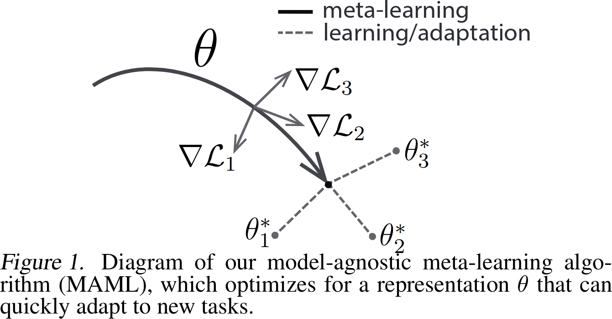
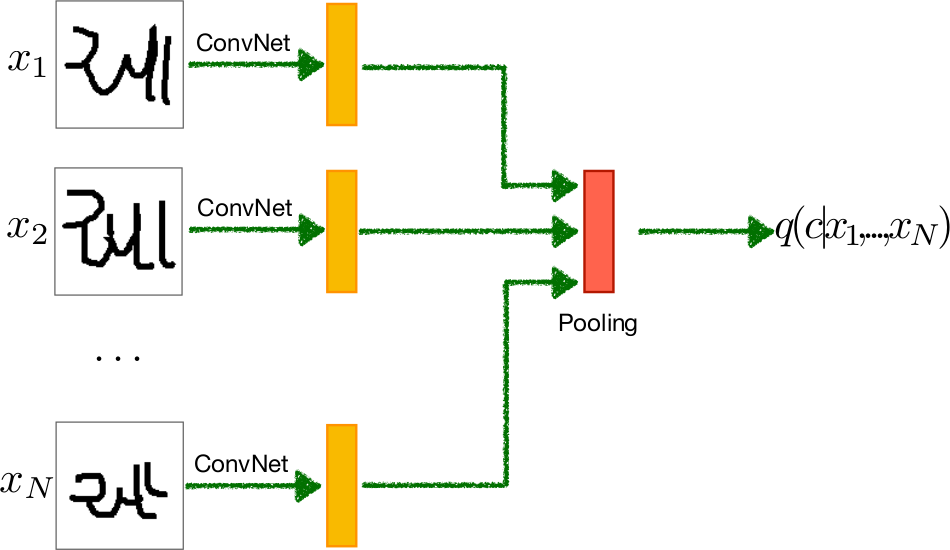
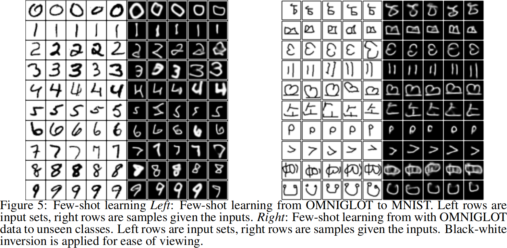
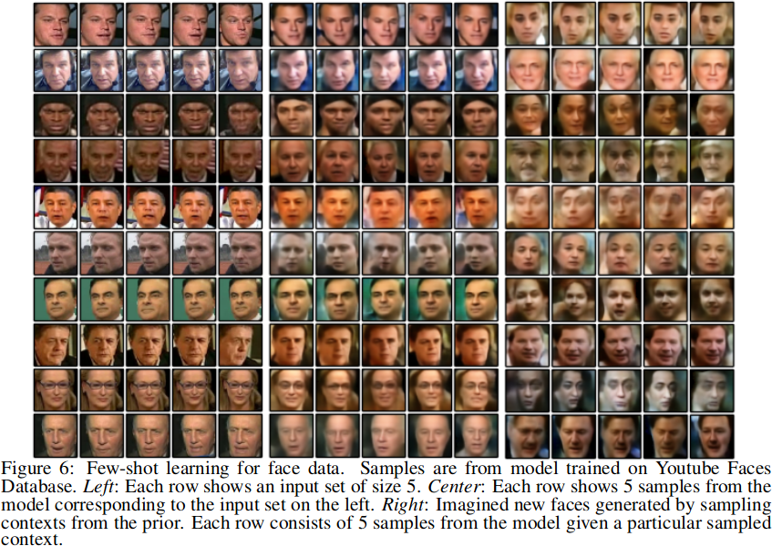
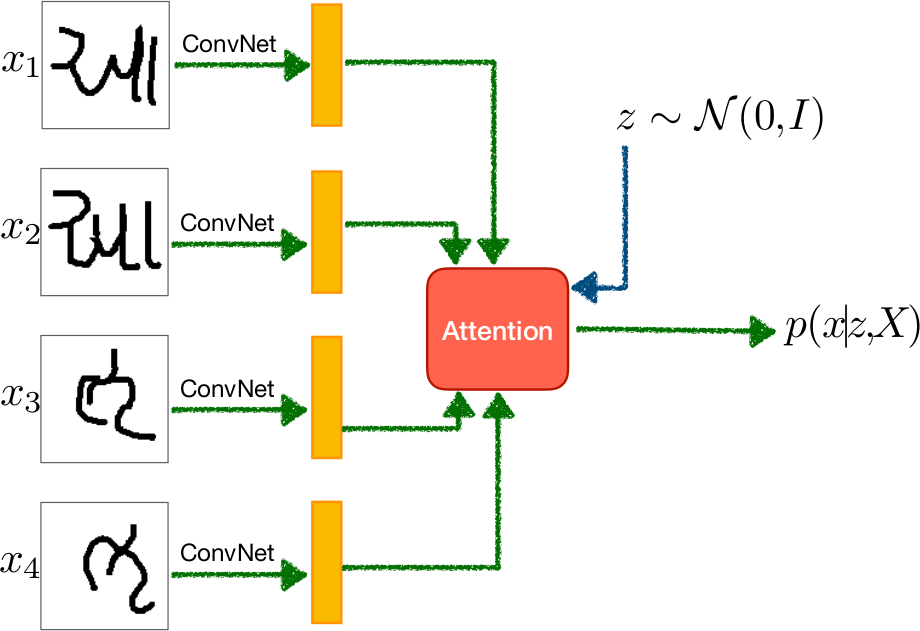
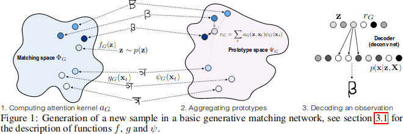
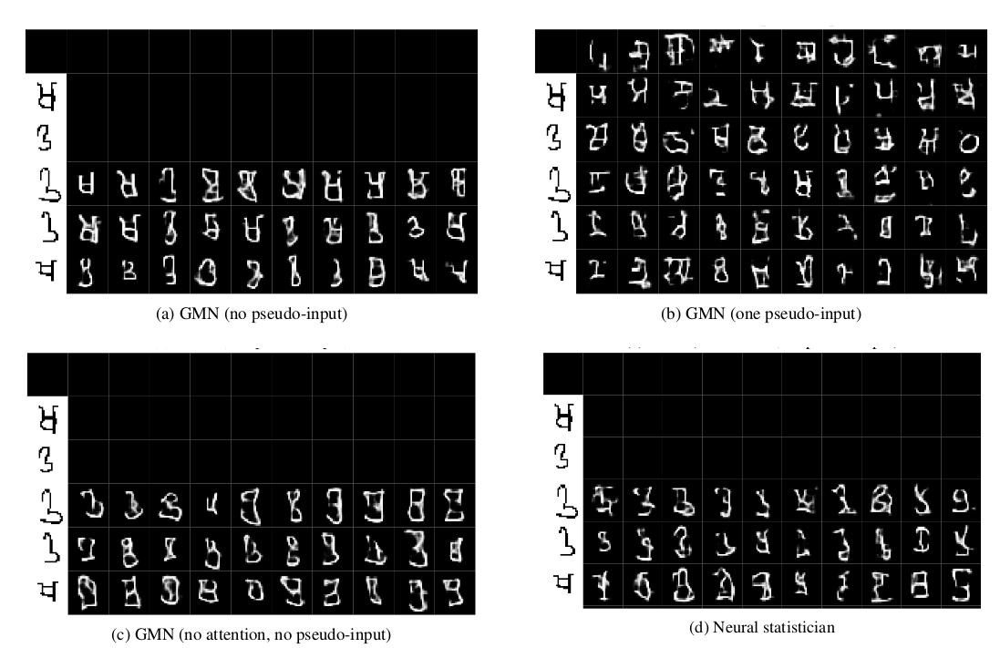
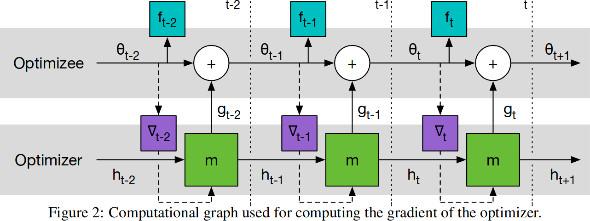
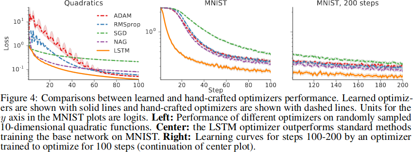
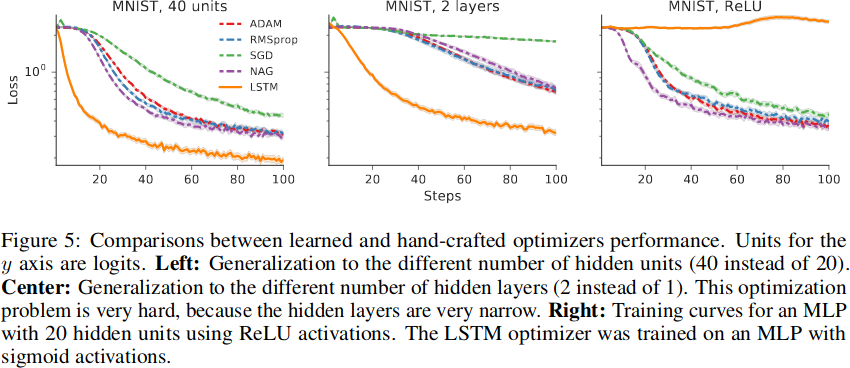

# Learning how to learn

~~~
\subtitle{Machine Learning and Data Mining}
\author{Maxim Borisyak}

\institute{National Research University Higher School of Economics (HSE)}
\usepackage{amsmath}

\DeclareMathOperator*{\E}{\mathbb{E}}

\DeclareMathOperator*{\var}{\mathbb{D}}
\newcommand\D[1]{\var\left[ #1 \right]}

\DeclareMathOperator*{\argmin}{\mathrm{arg\,min}}
\DeclareMathOperator*{\argmax}{\mathrm{arg\,max}}

\newcommand\dmid{\,\|\,}
~~~

### Meta-learning

Traditional learning:
- given problem $D = (X_i, Y_i)^N_{i = 1}$, $X_i, Y_i \sim P(x, y)$
- find decision function $f$
- that minimizes error $R(f, P)$.

Meta-learning:
- given family of problems $D_j = (X^j_i, Y^j_i)^{N_j}_{i = 1}$,
- $D_j \sim P^{N_j}_\theta(x, y)$, $\theta \sim P(\theta)$
- find mapping $g: D \to f$
- such that minimizes error $\E_{\theta} \E_{D \sim P^N_{\theta}} R(g(D), P_\theta)$

~~~footnotesize
  This definition is not commonly accepted.
~~~

### Meta-learning

~~~equation*
\Large
\text{data} = \underbrace{\underbrace{\text{shared knowledge}}_{\text{pre learn}} + \underbrace{\text{concept}}_{\text{learn to infer}}}_{\text{learn to combine}}
~~~

### Meta-learning flavors

- concept learning, few-shot learning;
- learning optimization procedure;
- learning model:
  - hyper-parameter optimization.

~~~footnotesize
While in practice these are quite distinct areas, theoretically, the lines are blurry.
~~~

## Few-shot learning

### Weight sharing

- model $f(\psi, \theta_i)$ with two sets of parameters:
  - $\psi$ --- independent of task;
  - $\theta_i$ --- parameters for $i$-th task.

Train:

~~~equation*
  \psi^* = \argmin \min_{\theta_1, \theta_2, \dots} \sum_i \mathcal{L}(f(\psi, \theta_i), D_i)
~~~

Test:

~~~equation*
  \theta^* = \argmin_{\theta} \mathcal{L}(f(\psi^*, \theta), D)
~~~

~~~footnotesize
  Also known as 'replace-head-of-an-already-trained-network' or transfer learning.
~~~

### 'Soft' weight sharing

Train:

~~~equation*
  \psi^* = \argmin_\psi \left[ \min_{\theta_1, \theta_2, \dots} \sum_i \mathcal{L}(f(\theta_i), D_i) + \sum_i \|\psi - \theta_i\|^2 \right]
~~~

Test:

~~~equation*
  \theta^* = \argmin_{\theta} \left[ \mathcal{L}(f(\theta), D) + \|\psi^* - \theta\|^2 \right]
~~~

~~~footnotesize
  Also known as fine-tuning of a pretrained network or transfer learning.
~~~

### Model Agnostic Meta-Learning

- 'soft' weight sharing constrains weights to be close to each other in $l_2$ space;
- instead let's directly incorporate test weights inference into training:

~~~equation*
  \psi^* = \argmin_\psi \left[ \sum_i \mathcal{L}(f(\psi_i), D_i) \right]
~~~

where:

~~~equation*
  \psi_i = \psi - \alpha \left. \frac{\partial \mathcal{L}(f(\theta), D_i)}{\partial \theta} \right\vert_{\theta = \psi}
~~~

### Model Agnostic Meta-Learning

## Generative models

### Neural Statistician

### Neural Statistician

### Neural Statistician

### Generative Matching Networks

### Generative Matching Networks

### Generative Matching Networks

## Learning optimizers

### Replacing gradient descent

~~~equation*
  \theta^{t + 1} = \theta^t + g_\psi(\nabla f(\theta_t))
~~~

~~~equation*
  \mathcal{L}(\psi) = \E_f \left[ w_t f(\theta_t) \right]
~~~

### Replacing gradient descent

### Replacing gradient descent

### Replacing gradient descent

## References

### References

- Edwards H, Storkey A. Towards a neural statistician. arXiv preprint arXiv:1606.02185. 2016 Jun 7.
- Bartunov S, Vetrov DP. Fast adaptation in generative models with generative matching networks. arXiv preprint arXiv:1612.02192. 2016 Dec 7.
- Finn C, Abbeel P, Levine S. Model-agnostic meta-learning for fast adaptation of deep networks. arXiv preprint arXiv:1703.03400. 2017 Mar 9.
- Munkhdalai T, Yu H. Meta networks. arXiv preprint arXiv:1703.00837. 2017 Mar 2.

### References
- Jia X, De Brabandere B, Tuytelaars T, Gool LV. Dynamic filter networks. InAdvances in Neural Information Processing Systems 2016 (pp. 667-675).
- Andrychowicz M, Denil M, Gomez S, Hoffman MW, Pfau D, Schaul T, Shillingford B, De Freitas N. Learning to learn by gradient descent by gradient descent. InAdvances in Neural Information Processing Systems 2016 (pp. 3981-3989).
