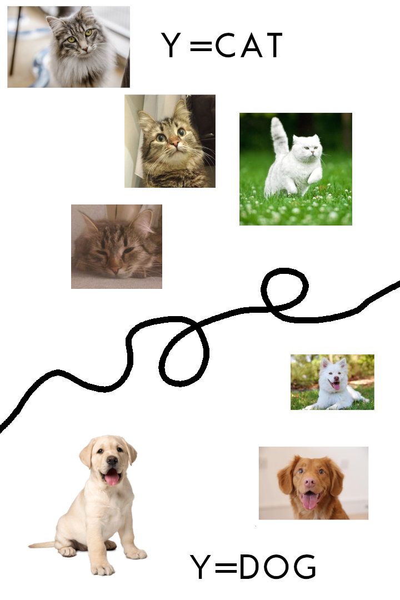
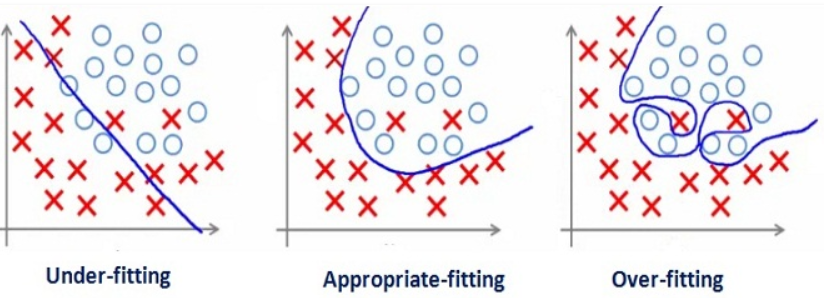
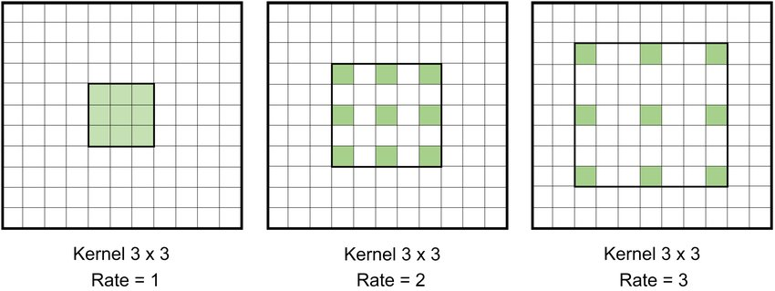

# Machine Learning and Data Mining

~~~
\author{Maxim Borisyak}

\institute{National Research University Higher School of Economics (HSE)}
\usepackage{amsmath}

\DeclareMathOperator*{\E}{\mathbb{E}}

\DeclareMathOperator*{\var}{\mathbb{D}}
\newcommand\D[1]{\var\left[ #1 \right]}

\DeclareMathOperator*{\argmin}{\mathrm{arg\,min}}
\DeclareMathOperator*{\argmax}{\mathrm{arg\,max}}

\newcommand\dmid{\,\|\,}
~~~

### Machine Learning

### Machine Learning

***

- data comes in;
- an algorithm (decision function) comes out.

### Typical learning algorithm structure

- model : $$\mathrm{model} = \{ f_\theta: \mathrm{inputs} \to \mathrm{predictions} \mid \theta \in \mathrm{parameters} \};$$
- solver : $$\mathrm{solver} : \mathrm{data} \to \mathrm{model};$$
  - loss function: $$\mathcal{L}(f, \mathrm{data}) = \sum_{x, y \in \mathrm{data}} \mathrm{error}(f(x), y);$$
  - optimizer: gradient descent, genetic algorithms etc.
- quality metric: shows how good algorithm is.

### Linear models

***

~~~eqnarray*
f(x) &=& w \cdot x + b;\\
w &\in& \mathrm{R}^2, b \in \mathrm{R}
~~~

~~~equation*
  \mathcal{L}(f) = \sum_i \log(1 + \exp(y_i f(x_i)))
~~~

### Non-linear models

***

### Over/under-fitting

### Over/under-fitting

### Put yourself into network shoes.

It is a Diplodocus:

### Put yourself into network shoes.

It is a Diplodocus:

### Put yourself into network shoes.

It is not a Diplodocus:

### Put yourself into network shoes.

It is not a Diplodocus:

### Put yourself into network shoes.

Is it a Diplodocus?

### Put yourself into network shoes.

Is it a Diplodocus?

### Put yourself into network shoes.

Is it a Diplodocus?

### How to detect

- split dataset into two:
  - training set --- for selecting decision function;
  - validation set --- for **independent** quality metric evaluation.
`\\[5mm]`
- $Q_\mathrm{validation} \approx Q_\mathrm{train}$ and both low --- probably underfitting;
- $Q_\mathrm{validation} \approx Q_\mathrm{train}$ and both high --- just right;
- $Q_\mathrm{validation} < Q_\mathrm{train}$ --- overfitting;

### Which ML algorithms are the best?

### IQ test: try to learn yourself!

First question from [MENSA](https://www.mensa.org/workout/questions) website:`\\`
*Following the pattern shown in the number sequence below, what is the missing number?*

$$1, 8, 27, ?, 125, 216$$

Possible answers:
- 36
- 45
- 46
- 64
- 99

### IQ test: try to learn yourself!

First question from [MENSA](https://www.mensa.org/workout/questions) website:`\\`
*Following the pattern shown in the number sequence below, what is the missing number?*

~~~center
\begin{tabular}{c | c c c c c}
$X_{\mathrm{train}}$ & 1 & 2 & 3 & 5 & 6\\
\hline
$y_{\mathrm{train}}$ & 1 & 8 & 27 & 125 & 216
\end{tabular}
~~~

`\vspace*{5mm}`

$$X_\mathrm{test} = (4, )$$

### IQ test: try to learn yourself!

My solution:
$$y = \frac{1}{12}(91 x^5 - 1519 x^4 + 9449 x^3 - 26705 x^2 + 33588 x - 14940)$$

- fits perfectly!

My answer:
- 99

### IQ test

Why solution:
$$y = x^3$$
seems much more suitable than
$$y = \frac{1}{12}(91 x^5 - 1519 x^4 + 9449 x^3 - 26705 x^2 + 33588 x - 14940)?$$

### No Free Lunch theorem

Given:
- binary classification;
- metric: off-training set accuracy;
- **uniform prior over problems**.

~~~center
  \Large Any two learning algorithms \textbf{on average} perform equally.
~~~

### No Free Lunch theorem

Given:
- binary classification;
- metric: off-training set accuracy;

~~~center
  \Large Any increase in performance on one set of problems \textbf{must}
  be accompanied by equivalent decrease on another.
~~~

### Example

`\begin{center}`

\hspace{0.03\textwidth}

\hspace{0.03\textwidth}

`\end{center}`

### Example

~~~center
{\Large Cartesian }
~~~

***

~~~center
{\Large Polar }
~~~

### Example

`{ \Large $$\min_{x \in \{0, \dots, 15\}} (x - 8)^2$$ }`

### Example

`{ \Large $$\min_{x \in \{0, \dots, 15\}} (x - 8)^2$$ }`

### Neural Networks

### NFL vs humans

~~~center
{ \large
One learning algorithm can not be better than others\footnote{assuming uniform prior over problems}.\\[5mm]

Family of algorithms can.
}
~~~

### "Neuron"

***

$$\mathrm{output} = \sigma(b + \sum_i w_i x_i)$$

- sum of all inputs with weights;
- non-linearity.

### Deep learning

***

- neurons are organized into layer;
- layer are typically connected sequentially.

### Convolutional Networks

### Convolutional Networks

### Convolutional Networks

### Types of convolution

- ordinary / atrous / strided;
- size of the window: 1x1 / 3x3 / 5x5;
- ordinary / depthwise / separable / ...

### Which one to choose?

### Which one to choose?

- people are bad at fine tuning;
  - even data scientists;`\\[5mm]`
- checking all possible combinations:
  - 5 layer network with 3 options for each layer:
    - 243 options ($\sim$ 1 year).

- evolutionary algorithms;
- Bayesian Optimization;

### DARTS

### DARTS

- $O_i(x)$ --- $i$-th candidate operation:
  - e.g. $O_1(x)$ - convolution 1x1, $O_2(x)$ - convolution 3x3, etc

$$O(x) = \sum_i \frac{\exp(\alpha_i)}{\sum_k \exp(\alpha_k)} O_i(x)$$

### DARTS

### DARTS

- $X_\mathrm{train}$ --- data for training;
- $X_\mathrm{validation}$ --- data for validation;

~~~eqnarray*
  \min_\alpha & \mathcal{L}_\mathrm{val}(w^*(\alpha), \alpha)\\
  \text{s.t.} & w^*(\alpha) = \argmin_w \mathcal{L}_\mathrm{train}(w, \alpha)
~~~

### DARTS

### Machine Learning and Data Mining

### Machine Learning and Data Mining

1. a little bit of theory:
  - No Free Lunch theorem;
  - bias-variance decomposition;
2. meta-algorithms:
  - boosting;
  - bagging;
  - stacking;
3. optimization:
  - gradient optimization;
  - black-box optimization  (incl. Bayesian Optimization);
4. Deep Learning:
  - overview, methods and tricks;
  - generative models (incl. RBM, VAE, GAN);
5. Meta Learning:
  - model selection (incl. DARTS);
  - learning to learn; concept learning.

### Summary

### Summary

1. Structure of a Machine Learning Algorithm.
2. No Free Lunch Theorem.
3. Neural Networks and Deep Learning.
4. Convolutional Neural Network.
5. Optimal Architecture Search.
6. The course's syllabus.

### References
- Wolpert DH. The supervised learning no-free-lunch theorems. InSoft computing and industry 2002 (pp. 25-42). Springer, London.
- Liu H, Simonyan K, Yang Y. Darts: Differentiable architecture search. arXiv preprint arXiv:1806.09055. 2018 Jun 24.
- Sermanet P, Chintala S, LeCun Y. Convolutional neural networks applied to house numbers digit classification. InPattern Recognition (ICPR), 2012 21st International Conference on 2012 Nov 11 (pp. 3288-3291). IEEE.
- Moscato P. On evolution, search, optimization, genetic algorithms and martial arts: Towards memetic algorithms. Caltech concurrent computation program, C3P Report. 1989 Sep;826:1989.
